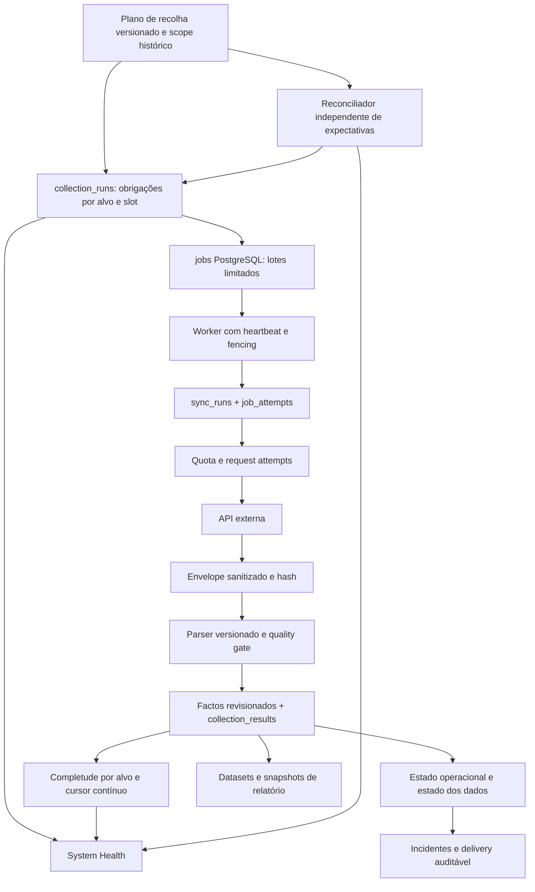
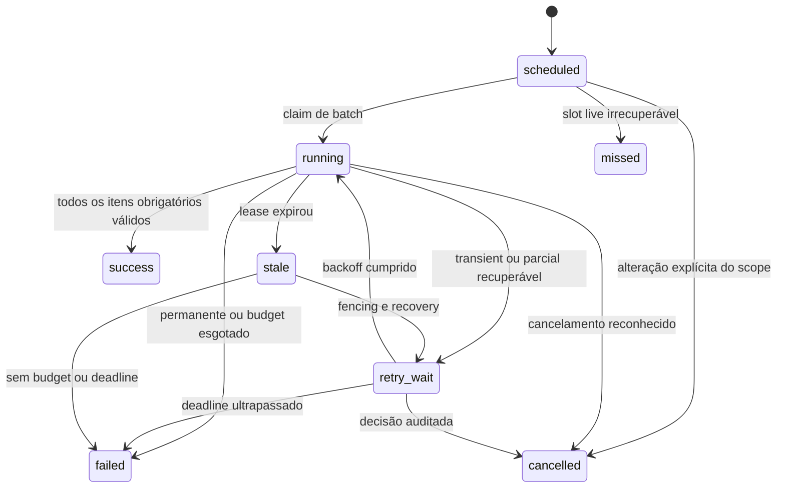

# Nem-sei V2 — auditoria técnica e plano de implementação

Data: 2026-09-07. Destinatário: Claude, como agente implementador.

Base auditada: `Rabinho2000/Nem-sei`, branch `v2/operacional`, commit `7815cb7aa316c7ee073a1b46aafc183c7b724a89`. Referência V1: `main`, commit `e3d252e418caa65f9ec704c2954103f3aaeb45f9`. A árvore `monitoring_board/` não tem diferenças entre estas duas revisões. `rewrite/v2` é anterior e não foi confundida com a versão operacional.

Convenções: **CURRENT** = encontrado no código; **PROBLEM** = defeito ou limite identificado; **PROPOSED** = decisão para implementação. Referências `path:linha` pertencem à revisão acima; localizar novamente a função se a branch evoluir. Uma afirmação em documentação sobre o servidor é evidência histórica declarada, não uma verificação de runtime desta auditoria.

## 1. Executive Summary

**Ainda não é defensável deixar de verificar manualmente os fornecedores.** O V2 tem uma base substancialmente melhor do que o ponto de partida descrito no pedido: PostgreSQL, fila durável, leases, eventos de jobs, contabilização de requests, produção com revisões, source policies temporais, saúde das integrações, instalações físicas, contactos, incidentes, ordens de trabalho, relatórios e scripts de backup/restore. Não é necessário reconstruir estes módulos.

O problema central é a falta de uma cadeia verificável entre **obrigação de recolher**, **tentativa**, **resposta**, **factos aceites** e **efeito operacional**. Contar jobs ou sync runs existentes não permite provar que nenhuma recolha esperada desapareceu.

Bloqueadores prioritários:

1. Sigenergy aceita payload vazio como dados `missing`, mas o serviço pode terminar `success` e avançar o cursor; pode igualmente fechar o dia ainda em curso.
2. Alguns handlers marcam sucesso perante falha/parcialidade. Os resultados dos jobs perdem contadores devido a uma allowlist estreita.
3. Lease de worker de 30 segundos sem heartbeat/renovação; a proteção por token só cobre a linha do job, não os commits de dados feitos pelo handler.
4. A seleção de estado e algumas somas de frota misturam mappings/fontes sem aplicar a política temporal correspondente.
5. Ausência de token Telegram pode escolher um mock que devolve entrega bem-sucedida. Uma entrega externa e o commit PostgreSQL também não são atómicos.
6. Não existe inventário histórico independente de recolhas esperadas por alvo/slot, nem prova atual de restore ou de completude do portfolio nesta auditoria.

**Decisão:** manter PostgreSQL como fila e registo de controlo. Acrescentar obrigações de recolha e vínculos de evidência, corrigir os contratos existentes, limitar as unidades de trabalho e proteger todos os commits por ownership. Não introduzir Kafka, Redis, RabbitMQ ou Celery.

**Classificação conservadora: Level 1 — Shadow.** O código permite operar em paralelo e inspecionar resultados; não há prova suficiente para promover o conjunto a fonte operacional principal. Isto é uma classificação de confiança baseada no código e nas verificações disponíveis, não uma afirmação de que o deployment atual esteja efetivamente configurado em shadow.

### Evidência e limites da auditoria

- Clone completo e leitura dos caminhos críticos V2 e V1; inspeção de modelos, migrations, handlers, integrações, queries, testes, Compose, segurança e scripts de recuperação.
- `alembic heads`: um head, `0044_production_scheduling`. Não equivale a aplicar migrations numa BD real.
- Scanner do próprio repositório: 794 ficheiros tracked verificados, sem findings nos padrões suportados. Não é prova de ausência de todos os tipos de segredo nem auditoria do histórico Git.
- Testes existentes executados: **62 passed** no total. As primeiras duas execuções produziram 31 passed, 31 skipped e 5 deselected. Os 31 golden inicialmente ignorados passaram depois numa cópia temporária com apenas o caminho V1 adaptado ao checkout local; os 5 deselected dependem de PostgreSQL. Detalhes na secção 20.
- Cinco probes sem rede/BD reproduziram os defeitos descritos na secção 20. Foram executados fora do produto, com doubles apenas nas fronteiras de I/O.
- Não havia Docker/PostgreSQL disponíveis neste ambiente local. Não foram executados ensaios de concorrência PostgreSQL, migrations sobre dados reais, restore nem kill de containers. Não foram feitas chamadas às contas FusionSolar/Sigenergy nem enviados alertas.
- Não foram disponibilizados acesso ao servidor, dump V1/V2, lista real de ativos esperados, configuração efetiva nem resultados recentes dos backups. Quantidades em comentários do código, como 134 centrais, não são inventário atual certificado.
- Não existe `.planning/` nesta revisão. `AGENTS.md` descreve ainda V1/SQLite e proíbe introduzir PostgreSQL, embora V2 já o utilize. Atualizar essa orientação para distinguir V1 e V2; não reverter a arquitetura real.

## 2. Current Architecture

| CURRENT | Implementação encontrada | Implicação |
|---|---|---|
| Web | `src/nemsei/app.py::create_app`, `wsgi.py`; Flask/Gunicorn | Um worker Gunicorn com duas threads no Compose; não é o worker da fila |
| Scheduler | `jobs/scheduler.py::Scheduler.run_once` | Loop próprio, sem APScheduler V2; lease PostgreSQL e switches por capacidade |
| Worker | `jobs/worker.py::Worker.run_once` | Um job síncrono por processo; claim, execução fora da transação de claim, finish/retry |
| Fila | `jobs/repository.py::JobRepository`, `jobs/models.py` | `FOR UPDATE SKIP LOCKED`, dedupe parcial, eventos, recovery |
| BD | `db/engine.py`, `db/session.py`, `migrations/` | SQLAlchemy/Alembic; PostgreSQL 16 no Compose; timeouts SQL e pool pre-ping |
| Providers | `providers/registry.py`, `contracts.py`, `errors.py`; `integrations/*` | FusionSolar, Sigenergy e Huawei SCADA; SMA é vocabulário sem adapter live equivalente |
| Coordenação V1 | `integrations/fusionsolar/request_control.py`, `v1_ownership.py`; `docker-compose.v1-ownership-broker.yml` | Conta `primary` condicionada por broker externo ao V2; outras contas não seguem necessariamente esse caminho |
| SCADA | `integrations/huawei_scada/listener.py`, `session.py`, `ingestion.py`, `rollup.py` | Serviço opcional adicional, entrada TCP, amostras e energia estimada; exige análise própria de liveness |
| Domínio | `assets/`, `installations/`, `sources/`, `monitoring/`, `diagnostics/`, `work_orders/` | Instalação física distinta do ativo técnico e da identidade externa |
| Relatórios | `reporting/assembler.py`, `datasets.py`, `finality.py`, `close.py`, `customer_pdf.py`, `excel.py` | Factos → datasets/snapshots → PDF/Excel; critérios explícitos de período provisório/final |
| Alertas | `notifications/service.py`, `episodes.py`, `digests.py`, `telegram_client.py` | Incidentes e episódios persistidos; decisão e entrega separadas, mas entrega ainda tem lacunas |
| Operação | `system/integration_health.py`, `automation_health.py`, `web/system_routes.py` | Já há UI de saúde; falta denominador de obrigações e saúde de processos independente |

Deployment encontrado: `docker-compose.v2.yml` com `postgres`, `web`, `scheduler`, `worker`, `migrate` manual e `scada-listener` opcional. Restart `unless-stopped`; PostgreSQL tem healthcheck; `/healthz` é liveness web e `/readyz` verifica BD/revisão Alembic. Não são provas da recolha. `scripts/v2_compose_up.sh` e `deploy/v2_deployment_components.json` tratam composição de overrides; comentários do Compose e docs contêm descrições entretanto ultrapassadas. Verificar configuração renderizada e processos reais em AUD-001.

## 3. Current Data Model

| Grupo | Tabelas/relações CURRENT e código |
|---|---|
| Identidade | `organizations → installations → assets → devices`; `assets/models.py`, `installations/models.py`; links organizacionais e de instalação podem ser nullable |
| Providers | `provider_connections → asset_provider_mappings`; mapping contém ativo, dispositivo opcional, external ID normalizado, datas e estado; `providers/models.py` |
| Escolha de fonte | `asset_source_policies` por ativo/uso/data/prioridade/fallback; `sources/models.py`, `sources/service.py::resolve_source_policy` |
| Execução | `jobs`, `job_events`, `scheduler_leases`, `schedule_state`; não existe FK de `sync_runs` para job/attempt |
| Ingestão | `sync_runs`, `sync_cursors`, `provider_request_states`, `provider_request_attempts`, `integration_health`; `sync/models.py` |
| Monitorização | `monitoring_observations`, projeção `monitoring_current_states`; `monitoring/models.py` |
| Energia | `production_facts`, com valor nullable, métrica, intervalo, qualidade, mapping, sync run e cadeia de revisões; unique mapping/source key/revision |
| Equipamentos/disponibilidade | `device_status_facts`, `device_availability_daily`, `asset_availability_daily`; `diagnostics/models.py`; migrations 0039–0043 acrescentam disponibilidade e evidência histórica |
| Operação | `diagnostic_incidents`, `incident_notes`, `work_orders`, `visits`, `work_order_incidents`; migrations 0017, 0023, 0033, 0038 |
| Contactos | `installation_contacts` contém a própria pessoa, diretamente ligada a uma instalação; migration 0034; não é ainda uma associação a `contacts` reutilizáveis |
| Comercial | `asset_service_contracts`, âmbito por instalação/ativo; `contracts/models.py`; modelos financeiros, tarifas e billing em `reporting/` |
| Relatórios/portfolios | `reporting_datasets`, `reporting_dataset_rows`, `report_snapshots`, modelos/fontes financeiras e entidades de portfolio em `portfolios/models.py` |
| Auditoria/importação | `operator_audit_events`, `legacy_import_runs`, `legacy_import_records`, `legacy_identity_decisions`; manifesto/hash/proveniência |

Pontos positivos: `timestamptz` nos instantes; `Date` para dias/validade; FKs `RESTRICT` nos factos e mappings; ausência não se converte globalmente em zero; revisões preservam correções. Pontos a reforçar: coerência entre asset e mapping garantida sobretudo no serviço; ausência de unicidade de obrigações; condições de período/valor mais fortes; locks de revisão/cursor; coerência de políticas temporais concorrentes. Nenhum orphan real foi demonstrado sem consultar a BD.

## 4. Current Ingestion Pipeline

| Etapa | CURRENT | Falha/deteção/retry e fronteira transacional |
|---|---|---|
| Fonte externa | HTTP FusionSolar/Sigenergy; TCP SCADA | Timeout HTTP por chamada normalmente 30 s; não é deadline global. Corpo é lido integralmente |
| Scheduler | `Scheduler.run_once`, `production_schedule_targets` | Seleciona ligações habilitadas; produção FusionSolar por BD + legacy env, restantes frequentemente uma ligação por env. Não materializa todas as instalações esperadas |
| Job creation | `enqueue_due_*` | Job, evento e avanço de schedule na mesma transação curta. Dedupe cobre apenas jobs ativos |
| Queue | `claim_next` | Claim exclusivo via `SKIP LOCKED`; prioridade 100 produção, 120 estado, 150 várias tarefas, 200 retenção. Não há fairness por alvo |
| Worker | `run_once → execute` | Recovery antes de claim; exceções genéricas repetidas; sem heartbeat durante execução; SIGTERM aguarda retorno do handler |
| Request | request controllers + `reserve_request` | Reserva persistida antes do HTTP; resultado depois. Contador `actual_call_count` incrementa na reserva, antes de saber se houve chamada |
| Raw | objetos `HttpResponse`/`SigenergyHttpResponse` em memória | Factos guardam campos/metadata selecionados, não envelope completo sanitizado com hash e parser version para todos os requests |
| Parsing | `normalize_daily_production_row`, `parse_daily_history`, parsers de estado | FusionSolar verifica ID e timestamp do dia, duplicados e ausência. Sigenergy parser distingue `missing`, mas serviço não propaga sempre a incompletude |
| Normalização | `record_production_fact`, `record_observation` | Factos revisionados, dedupe por igualdade; leitura de última revisão seguida de insert sem serialização por chave |
| Persistence | `_persist_day` FusionSolar, `_persist` Sigenergy | Commit por batch ou mapping/dia. Job pode morrer depois de factos e antes de checkpoint/finish; replay sequencial tende a ser seguro, concorrência ainda não |
| Cursor | `_finish` FusionSolar; `_advance_cursor` Sigenergy | FusionSolar avança com sucesso/completude e janela contínua; Sigenergy fecha run e avança cursor em transações separadas, podendo avançar sobre vazio/parcialidade de métricas |
| Derived state | `installation_state.py`, projeções e source policies | Distingue stale/no_evidence, mas query de estado cruza observação e confirmação de mappings potencialmente diferentes |
| Alarmes/incidentes | `diagnostics/incidents.py`, `findings.py` | Diagnósticos existem; não foi encontrado coletor live de alarmes nativos V2 equivalente ao endpoint V1 |
| Reporting | assembler/finality/datasets/snapshots | Boa base de finality; deve consumir fonte canónica única e evidência de dias completos/corrigidos, não apenas existência de números |

Uma falha parcial pode deixar factos válidos de outros alvos já gravados. Isso é desejável; o que falta é representar quais alvos terminaram, quais faltam e qual tentativa os produziu. Não tentar resolver com uma transação gigante em volta de toda a API.

## 5. Failure Analysis

P0 = bloqueia confiança/cutover; P1 = necessário para Level 2/3; P2 = melhoria operacional posterior. Severidade não significa que houve incidente confirmado em produção. “Reproduzido” abaixo significa probe local; “estático” significa cenário demonstrável pelo fluxo de código, ainda sem ensaio concorrente real.

| ID / failure | CURRENT behaviour + evidência | Risk | Detection atual | Recommended behaviour | Priority |
|---|---|---|---|---|---|
| F01 — vazio Sigenergy avança | `sigenergy/production.py:278–295`: accepted aumenta mesmo se `ParsedDay.quality=missing`; `partial` só depende de `last_error` | Gap invisível e cursor sobre dados inexistentes | Factos missing existem, run diz sucesso; reproduzido | Completude por alvo/dia/métrica; nunca avançar por existência do payload | P0 |
| F02 — dia em curso Sigenergy | `sync_incremental:191–205` usa `utc_now().date()` e inclui today; sem overlap normal com dia anterior | Guarda contador intradiário como dia final; no dia seguinte pode não corrigir | Sem finality de origem; janela reproduzida | Dias fechados no timezone verificado; atual intradiário separado; reconciliação D-1/D-2 | P0 |
| F03 — sucesso do job incorreto | `jobs/handlers.py:193–246`: Sigenergy partial → success; monitoring sempre success | Taxa de sucesso enganadora, retry incorreto | `sync_runs` pode mostrar falha; probe parcial reproduzido | Resultado semântico uniforme + retry independente de classificação | P0 |
| F04 — outcome failed rejeitado | Handler Sigenergy devolve failed; `JobRepository.finish:310` só aceita success/partial | Erro real substituído por ValueError e retry genérico | Eventos finais mostram erro de contrato; reproduzido | Worker dispatch terminal explícito por outcome; preservar provider error | P1 |
| F05 — lease sem renovação | `config.py:99` 30 s; `jobs/worker.py`; `repository.py:609` | Segundo worker recupera handler ainda vivo; duplicação de requests/commits | LeaseExpired só depois; não prova morte | Heartbeat + deadline + fencing dos commits, secção 9 | P0 |
| F06 — ownership só na fila | `finish:316` token no job; `monitoring/service.py`, adapters sem token | Worker antigo grava depois de perder lease; estado pode regredir | Unique pode gerar erro; não bloqueia todas as escritas obsoletas | Transação de persistência bloqueia job/attempt e valida geração válida | P0 |
| F07 — recolha nunca criada | `schedule_state`, `_catch_up_slot:68`, `enqueue_due_*` | Slots históricos saltados deixam de ser contáveis por alvo | Há schedule overdue, não lista histórica independente | Plano versionado + obrigações + reconciliação missing | P0 |
| F08 — deferral indefinido | `worker.py`, `repository.py::defer`: zero-call não gasta budget | Waiting eterno sem atingir falha final | Eventos existem; sem prazo total de recolha | Não gastar budget HTTP, mas aplicar deadline/SLO e alarme blocked | P1 |
| F09 — contadores removidos | `jobs/repository.py:41::safe_metadata` usado em finish | expected/accepted/rejected/error_code/facts_written omitidos | `result_status` sobrevive; reproduzido | Colunas tipadas/resultado versionado sanitizado | P1 |
| F10 — request reservado ≠ enviado | `sync/service.py:288`; FusionSolar broker pode negar depois | “actual calls” inflacionado, crash ambíguo | reserved fica aberto; sync sweep não prova request | Estado reserved/sending/responded/unknown; métricas honestas | P1 |
| F11 — retries multiplicados | Controllers repetem transient até 2 chamadas, worker até 3 tentativas; 60/300 s | Burst, duplicação após timeout; permanente tratado como transient no job | Tentativas persistidas parcialmente | Uma política de budget, backoff com jitter, bloqueio config/auth | P1 |
| F12 — reservas simultâneas | `reserve_request` bloqueia contador mas não avança next_allowed_at nem fixa in-flight | Vários workers podem chamar o mesmo endpoint ao mesmo tempo | Rate limit posterior | Slot de quota por conta/família e limite de in-flight | P1 |
| F13 — revisão/cursor concorrente | `record_production_fact`, `record_observation`, `advance_cursor` fazem read-modify-write | Unique conflict; update de cursor fora de ordem | Exceção em alguns casos, last writer noutros | Lock por chave/stream; cursor monotónico sob lock | P0 |
| F14 — estado entre fontes | `monitoring/installation_state.py:208–225` última observação por asset e max confirmação separadamente | Uma fonte recente “refresca” estado antigo de outra | Não explicitamente | Escolher política → mapping → observação+confirmação da mesma fonte | P0 |
| F15 — soma de fontes duplicadas | `web/series.py::portfolio_monthly_series`, `fleet_metric_totals:508`: última revisão por mapping, depois soma todos | Primária+fallback para mesmo dia podem somar duas vezes | Cobertura por asset não revela duplicação | Resolver única fonte por ativo/métrica/dia antes de somar | P0 |
| F16 — discovery incompleto | Sigenergy `client.py::discover_systems` uma chamada; `_rows_from_data` filtra não-dicts; FusionSolar filtra não-dicts também | HTTP 200 pode parecer lista completa | Rejeições do serviço não veem itens já descartados | Preservar contagem bruta, validar paginação/total, falhar fechado | P1 |
| F17 — ativos desaparecidos | `sigenergy/discovery.py::reconcile` itera apenas plantas recebidas | Mapping anterior desaparecido não aparece na reconciliação | Ausência em polls/estado stale, não inventário explícito | Snapshots completos e diff nos dois sentidos | P1 |
| F18 — alvo problemático bloqueia progresso | Cursor produção por ligação; FusionSolar interrompe janela no erro; Sigenergy não avança em erro parcial | Um alvo prende história dos saudáveis; worker único pode monopolizar frota | Partial/retries, cobertura insuficiente por alvo | Child outcomes duráveis + cursor por stream/alvo; batches limitados | P0 |
| F19 — abandono inferido | `sync/abandonment.py::classify` silêncio de requests >1 h; sem job FK | Pode declarar morte com owner vivo mas parado; sem retoma segura | Sweep marca failed/abandoned e data retrospetiva | Ownership/heartbeat explícitos; observed_last_alive separado de detected_at | P1 |
| F20 — sem raw reprocessável | `production.py::_persist_day`, Sigenergy `_persist` | Não se consegue explicar parsing de um campo descartado | Metadata parcial | Envelope sanitizado com hash, contrato/parser e retenção limitada | P1 |
| F21 — mock Telegram em runtime | `telegram_client.py::default_client_factory` sem token retorna mock; mock `send_message` devolve delivered=True | Alerta marcado sent sem entrega | Configuração, não delivery real | Mock só testing explícito; runtime sem token = configuration_failed | P0 |
| F22 — entrega concorrente/ambígua | `notifications/service.py:171–196`: lê sem row lock, envia dentro da transação | Dois processos enviam; morte depois de envio causa reenvio | Sem receipt persistido/unknown | Lease de delivery, request fora da transação, estado unknown; não prometer exactly-once Telegram | P1 |
| F23 — backup incompleto elegível | `v2_postgres_backup.sh` escreve nome final antes de terminar; retenção após `test -s` | Dump interrompido pode ser elegível; perda do host perde cópia local | Exit não-zero ajuda; sem manifest/estado persistente | `.partial` → checksum/TOC → rename atómico; cópia externa e restore agendado | P0 para Level 3 |
| F24 — restore insuficiente | `v2_postgres_restore_smoke.sh` restaura, valida head atual e count jobs | Não prova domínio/segredos; backup antigo válido rejeitado por head mais novo | Script existente, execução atual desconhecida | Restore na versão do backup + upgrade isolado + invariantes/app smoke | P1 |
| F25 — alcance canário/flags | `scheduler.py`, Compose: alguns caminhos uma ligação/cap vitalício | Ativos fora do scope ou recolha termina no cap | Automation health ajuda; não inventário completo | Scope persistido por capacidade e alerta antecipado de expiração | P0 |
| F26 — integridade insuficiente | `monitoring/models.py` sem check de período positivo; coerência asset/mapping só serviço; policies sem exclusão de overlaps | Escritas concorrentes/diretas inconsistentes | Validações Python parciais | Constraints progressivas após diagnóstico de dados | P1 |
| F27 — input HTTP/segurança | Transports `response.read()` sem cap; Sigenergy aceita http/endpoint absoluto; auth admin único | Memória, envio a destino configurado errado, sem isolamento cliente | Timeouts/auth existem; não scanner completo | Cap do corpo/deadline, allowlist HTTPS; RBAC antes de Level 4 | P1/P2 |
| F28 — saúde otimista ao começar | `sync/service.py::start_sync_run` chama `record_health` sem erro → last_success_at | Iniciar trabalho renova indicador de sucesso antes da recolha | last_successful_sync_at é distinto, mas UI usa last_success_at | Separar start/attempt de sucesso completo por capability | P0 |

## 6. Target Ingestion Architecture

**PROPOSED: estender, não duplicar, a fundação existente.** `jobs` continua a ser a fila executável. `collection_runs` representa obrigações por alvo e slot. `sync_runs` continua a ser uma tentativa de aquisição em lote, agora ligada a job attempt. `provider_request_attempts` representa I/O. `collection_results` liga uma obrigação às tentativas/respostas/factos, inclusive quando um único request cobre 100 alvos.



Não criar 265 chamadas se a API responde a 100 instalações por chamada. Criar 265 obrigações e 3 batches, cada resposta com outcomes individuais. Uma obrigação usa **asset/provider mapping/capability**, não só installation: uma instalação física pode conter vários ativos e fontes. A instalação é a agregação operacional.

| Problem | Current limitation | Proposed solution | Why this solution | Simpler alternative considered |
|---|---|---|---|---|
| Provar expected/lost | Só registo de trabalho que chegou a existir | Planos históricos + obrigações em Postgres | Permite recalcular expectativas sem depender da fila | Só adicionar scheduled_for a jobs não revela jobs nunca criados |
| Recuperar crashes | Lease apenas da fila | Heartbeat e fencing nos commits | Reutiliza BD e impede escrita obsoleta | Lease muito longo só adia o problema |
| Requests caros | Quota reativa | Reservas de quota e batches limitados | Mantém poucos processos | Broker novo não corrige contratos dos dados |
| Investigar valores | Metadata incompleta | Raw sanitizado por período limitado | Replay local sem chamadas | Logs não mantêm relação transacional nem retenção suficiente |
| Reutilizar pessoas | Contacto por instalação | Contacts + associação | Migração aditiva; UI existente adapta-se | Copiar campos continua a duplicar pessoas |
| Detectar morte do sistema | Mesmo sistema produz a sua saúde | Probe exterior mínimo + estado DB auditável | Detecta host/BD mortos | Uma página no host morto não pode avisar ninguém |

PostgreSQL documenta `SKIP LOCKED` como apropriado para consumidores de fila, embora não forneça uma vista geral consistente dos dados; usar apenas no claim, não no cálculo de completude. [PostgreSQL 16 — SELECT](https://www.postgresql.org/docs/16/sql-select.html).

## 7. Collection Run State Machine

**PROPOSED** estados da obrigação, distintos dos estados de `jobs`:



`success`, `failed`, `missed`, `cancelled` são terminais. Uma recuperação manual cria uma execução de reparação ligada por `repairs_run_id`, não apaga o failure original nem melhora retroativamente a taxa “on time”. `partial` é uma dimensão de completude e um outcome de tentativa; enquanto recuperável a obrigação fica `retry_wait`, e ao esgotar passa a `failed` com `completeness=partial`. Preservar factos válidos.

`MISSING` é uma anomalia calculada: existe uma obrigação derivável do plano histórico mas não existe `collection_run` para a chave. Não tentar encontrar linhas missing apenas consultando a tabela que as perdeu. Persistir o finding antes de reparar e manter `first_detected_at`, `repaired_at` e evidência. `LOST` inclui missing não reconciliado e obrigações não terminais que ficaram sem executor/retry válido depois do prazo; publicar as duas componentes, sem dupla contagem. `stale` não é um estado da instalação.

Cada transição deve ser CAS sobre estado/generation anterior, gravar evento e outcome na mesma transação. Terminal success exige `completed_at`, `accepted_required=expected_required`, zero rejeições obrigatórias e referência de evidência. Uma resposta vazia só pode ser sucesso se o contrato da capacidade permitir explicitamente vazio e houver prova de scope esperado vazio; nunca inferir isso de HTTP 200.

## 8. Scheduler Architecture

CURRENT: `schedule_state.next_run_at` é durável; `_catch_up_slot` salta backlog para now; jobs levam `scheduled_for` no JSON. Preservar a prevenção de tempestades de polling, mas registar os slots perdidos. Produção FusionSolar tem bootstrap explícito e cursor; Sigenergy ainda tem caminho singular sem backfill no handler.

PROPOSED algoritmo:

1. Um `collection_plan` estável por capacidade/conta e scope explícito. Cada alteração cria versão imutável com `effective_from/effective_until`, intervalo, âncora UTC ou calendário local, timezone, deadline e scope snapshot temporal.
2. Materializar obrigações até 24 h à frente, com unique `(plan_id, target_id, scheduled_for)`; guardar versão e mapping escolhidos. Slots UTC de intervalo fixo: `anchor + n*interval`. Calendários locais usam timezone IANA e política explícita para horas inexistentes/repetidas.
3. A habilitação inicial começa na âncora futura estabelecida; não inventar passado anterior à ativação. Um alvo bloqueado por mapping/configuração pertence ao inventário contratado, aparece como blocked obligation e não desaparece da contagem por ter sido filtrado.
4. Criar job de batch e ligações aos child runs atomicamente. Não executar API no scheduler. Lease do scheduler não é suficiente por si: cada avanço de watermark bloqueia a linha do plano e valida generation/owner dentro da transação.
5. Em restart, gerar obrigações ausentes desde o último watermark. Polls históricos viram `missed` com motivo `scheduler_outage`; executar apenas poll atual. Histórico diário vira backlog limitado por budget; manter cada dia em dívida explicitamente visível.
6. Reconciliador, num caminho distinto da criação da fila, recalcula plano × scope × slots dos últimos 7 dias e verifica missing. Corre a cada minuto no scheduler e pode ser chamado pelo probe operacional; não depende de um job atrás da fila parada. Guardar período verificado e horizon de planeamento.
7. Se scheduler/BD estiverem mortos, probe exterior alerta. No regresso, reconciliação cria missed/backfill e regista o intervalo da falha, sem fingir que foi executado a tempo.
8. Produção, estado corrente, devices, discovery e alarmes têm planos separados. Deadline e prioridade por capacidade; devices não podem depender implicitamente do sucesso da produção diária.

Correção adicional: `enqueue_due_morning_briefing` ancora a primeira hora local mas os slots seguintes somam 1440 minutos (`jobs/repository.py`). Recalcular o próximo dia local para preservar 09:00 através do DST. Aplicar à nova função de calendário e testar as duas transições de Europe/Lisbon.

## 9. Worker Architecture

Manter claim `SKIP LOCKED` e transações curtas. Aumentar concorrência só depois de implementar fencing e quota. Configuração inicial proposta: lease 120 s, heartbeat 20 s, timeout de ligação 5 s, leitura 25 s, deadline total do batch 90 s. Estes são defaults de teste a calibrar no canário, não SLAs já medidos. Um batch executa no máximo 1 chamada de dados e uma autenticação necessária; pausa/requeue entre batches e entre dias.

Ownership:

- `job_attempts` tem UUID, job ID, número, owner, generation, started/heartbeat/deadline/finished; `sync_runs.job_attempt_id` referencia-o.
- Heartbeat usa sessão/ligação própria; renova só se token/generation vigente e não expirado. Heartbeat de processo não prova progresso: guardar `last_progress_at` e aplicar deadline mesmo com heartbeats vivos.
- Antes de cada chamada verificar lease, cancelamento, orçamento de conta e deadline. Durante HTTP a renovação pode correr numa thread pequena; Session SQLAlchemy nunca partilhada entre threads.
- Antes de cada commit de raw promovível/factos/cursor/outcomes: bloquear a linha job, verificar running/token/generation e lease vigente pelo relógio da BD. Se perdeu ownership, rollback e abandonar. O recovery bloqueia a mesma linha. Esta ordem impede o commit obsoleto que um simples `if` anterior ao HTTP não impede.
- Em crash depois de receber mas antes de persistir, estado da chamada é unknown. READ pode repetir; dedupe de factos é obrigatório. Não declarar exatamente uma chamada externa.
- Recovery CAS marca stale, termina attempt antigo, revoga token e só depois programa outro. Execução física de HTTP antiga pode ainda terminar; nenhum resultado seu poderá atualizar domínio. Para transport sem cancelamento, não prometer ausência absoluta de duas chamadas em voo.
- Worker preso: supervisor/deadline termina a unidade; outro processo não depende do handler preso para detetar stale. Uma unidade malformada não deve encerrar o loop inteiro nem monopolizar a frota.
- Cancelamento running é pedido persistente; aplicar entre chamadas e antes do commit. Factos já committed ficam; não mentir com rollback de trabalho histórico. DB indisponível: parar novas chamadas e ownership expira; retry da ligação com espera limitada.

Prioridades com fairness: produção diária/backfill separados; estado atual não fica atrás de semanas de bootstrap. No máximo um batch em voo por stream/conta conforme quota; rodar alvos entre ciclos. Medir idade máxima da fila, não só comprimento.

## 10. Idempotency Strategy

CURRENT: factos append-only com `(provider_mapping_id, source_fact_key, source_revision)` unique; `record_production_fact` reutiliza versão igual e cria revisão para correção. Dedupe de jobs é apenas ativo. Não substituir histórico por upsert cego no valor.

PROPOSED:

- Obrigação: `(plan_id, target_id, scheduled_for)` unique permanente. target identifica asset/mapping/capability; alteração de mapping produz nova versão de target, sem alterar obrigações antigas.
- Facto de energia: mapping + métrica + granularity + source day/intervalo + versão do contrato. Serializar read/latest/insert por lock da linha de stream existente; criar stream com upsert antes do lock. A unique atual permanece como última defesa; em colisão reavaliar sob lock, não fazer retry HTTP.
- Estado/device: chave source event quando existe; sem timestamp de origem, distinguir confirmação do estado de nova observação. Não inventar timestamp de dispositivo. Atualizar projeção apenas com evidência da fonte selecionada e sem recuar source time.
- `collection_results` é unique `(collection_run_id, job_attempt_id, provider_request_attempt_id)` com contadores e links de facto. Facto reutilizado deve criar evidência de confirmação também, sem criar revisão fictícia só para ligar a nova recolha.
- Cursor por alvo/stream/capability/contrato é maior fronteira **contínua** de dias completos. Calcular sob lock após commits dos dias; saltos não são permitidos. Janela sobreposta que devolve correção cria revisão, sem somar antigo+novo.
- Fatos + resultados + avanço do cursor desse alvo na mesma transação de persistência. Finish do batch/job pode ser posterior; reexecução encontra child completo e não repete a chamada desnecessariamente.
- Reprocessamento raw tem `parser_version`, `reprocess_of` e comparação de output digest. Nova versão só se significado mudou. Não usar hash da resposta inteira como chave do facto: campos voláteis produziriam duplicados.
- Relatórios usam fonte resolvida uma vez por ativo/métrica/dia e snapshots imutáveis. Duas contas da mesma central não são duas centrais. Correção posterior cria nova versão do relatório, com razão e referências, sem alterar o já aprovado.

## 11. Retry Strategy

Orçamento proposto: no máximo 5 tentativas reais por obrigação, deadline próprio, sem retries escondidos no transport. Backoff com jitter total entre 0 e `min(30s * 2^(n-1), 10min)`, respeitando limites mínimos de quota; deadline prevalece. Calibrar após medir duração/quota; não converter estes valores em alegação de disponibilidade do fornecedor.

| Classe | Exemplos | Ação |
|---|---|---|
| transient | timeout, DNS/conexão, HTTP 500/502/503/504 | retry_wait, budget e deadline; resposta anterior desconhecida não é sucesso |
| rate_limited | 429, FusionSolar failCode 407 | Respeitar Retry-After numérico ou HTTP-date; sem indicação, manter fallback atual 600 s até medição melhor; jitter só depois do mínimo |
| authentication/session | 401 ou USER_MUST_RELOGIN comprovado | Invalidar cache e uma autenticação coordenada por conta; repetir request dentro do budget |
| authentication/credentials | Credencial rejeitada após login | failed/configuration_required; suspender novas chamadas desse stream até alteração auditada; não bloquear outras contas |
| authorization/configuration | 403, mapping errado, unidade/fuso não verificados | falha explícita sem retry cego; discovery/revisão de configuração |
| resource removed | 404/ID ausente | não apagar ativo; revalidar via discovery completo e marcar needs_review |
| invalid response | JSON inválido, envelope contraditório, timestamp impossível | reter raw sanitizado/quarentena; uma repetição controlada se plausível erro temporário; depois failed |
| partial | alvos/métricas/páginas ausentes | Persistir bons, retry apenas faltantes; deadline fecha failed/partial |
| local DB | antes/depois do HTTP | Não fazer mais requests para reparar evidência; tentar persistência dentro do lease, senão unknown/recovery |
| no-call deferral | cooldown/broker ocupado | não gasta tentativas HTTP; consome tempo de SLA e produz evento; ao deadline failed/blocked |
| unexpected code error | TypeError, invariant, parser bug | falha de software com erro sanitizado; retry limitado só se classificado recuperável, sem reclassificar como indisponibilidade externa |

Dead-letter é uma consulta de `collection_runs.status=failed` com error class e workflow de reparação, não um broker novo. Requeue manual exige razão/ator, preserva erro anterior e aponta para o original. Credenciais nunca entram em `error_message`; exceções SQL/HTTP brutas não devem ser publicadas automaticamente.

## 12. Data Freshness Architecture

CURRENT: `MonitoringObservation.condition/freshness/quality/completeness` e `MonitoringCurrentState.last_confirmed_at` já separam dimensões. `installation_state.py` volta a reuni-las numa enum UI com `stale/no_evidence`. Evoluir o read model sem destruir estes factos.

PROPOSED dois eixos visíveis:

- `operational_state`: operating, standby, degraded, fault, offline, stopped, unknown. `stopped` só por evidência explícita/intervenção; `offline` só quando a fonte confirma falta de comunicação do ativo, não quando a API falha.
- `data_state`: fresh, stale, missing, collection_failed, source_unavailable, partial, unknown. Para evitar perder informação, payload tem ainda `freshness`, `completeness`, `latest_collection_status` e `reason`; badge é projeção com precedência documentada.

Guardar `source_observed_at`, `received_at`, `last_confirmed_at`, `last_complete_at`, `expected_next_at`, `stale_after`, `clock_basis` e mapping da evidência. Zero medido = 0 + evidência; falta = NULL. Uma última medição zero stale continua disponível como histórica, sem ser apresentada como valor atual.

Cadência inicial baseada no Compose: estado de plantas 15 min → stale após 2 intervalos + 5 min; devices 30 min → stale após 2 intervalos + 5 min. Isto deteta problemas antes da regra de gaps de disponibilidade de 90 min referida no código. Produção diária não usa estes TTLs: expected após fecho do dia no timezone da fonte + atraso de publicação verificado. Medir esse atraso antes da promoção; um contrato não verificado aparece unknown/configuration_required.

Agregação da instalação preserva `n_expected/n_fresh/n_missing/n_failed`; uma parte fresca não apaga uma parte stale. Escolher fonte com política temporal para o mesmo instante/dia, nunca `max(last_confirmed_at)` de todas. Ausência de timestamps de origem em Sigenergy/SCADA significa frescura da receção, com confiança limitada e clock_basis exposto.

## 13. Observability & System Health

CURRENT: `system/integration_health.py::system_health` conta sync runs iniciados em 48 h; `automation_health.py` interpreta schedules e heartbeat noop. Não chamar a isto expected collections. `start_sync_run` renova last_success prematuramente (F28).

PROPOSED métricas DB, janela `[from,until)` por `scheduled_for`, medidas `as_of`:

```text
Expected = obrigações derivadas de planos/scope históricos, com slot na janela
Accounted = linhas collection_run correspondentes às mesmas chaves
Missing = Expected menos Accounted
Expected = Missing + Scheduled + Running + Retry_wait + Stale + Success + Failed + Missed + Cancelled
```

As parcelas são exclusivas. `Lost` é um indicador de anomalia, não outra parcela a somar. Manter `missing_detected_total` mesmo após reparação. `unknown outcome` de request é separado de `unknown collection state`.

Success on time = obrigações elegíveis concluídas completas até deadline / obrigações elegíveis cujo deadline já venceu. Publicar também sucesso eventual, atraso p50/p95/p99, tentativas, partial, blocked, missed e cancelled. Cancelamentos pós-vencimento não saem do denominador; planned maintenance anterior ao slot é exclusão auditada, publicada à parte. Janela sem elegíveis = N/A, nunca 100%.

Dados para o painel:

- Planeamento: horizon, last_reconciled_slot, missing/lost, alvos sem plano e overrides desativados inesperadamente.
- Execução: oldest queued, leases expirados, running/retrying, duração, fail class, actual requests confirmed/unknown/reserved. Evitar `actual_call_count` atual como verdade absoluta.
- Dados: cobertura por mapping/capability/dia e último sucesso completo; concentração de falhas por conta/alvo; facts inserted/reused/revised/rejected separados.
- Processos: `process_heartbeats` por instance UUID/role/build/config digest, last_seen/last_progress; worker idle deve bater heartbeat; scheduler saudável não implica worker saudável.
- Backups: último backup complete/verificado/copied e último restore_test PASS com timestamps, checksum e duração. Ausência = unknown/missing, não OK.
- UI: drill-down obrigação → attempts → requests → evidência → factos → snapshot/incident. Estados essenciais vêm da BD; logs estruturados com correlation IDs apenas complementam.

Probe exterior mínimo, noutro failure domain, verifica heartbeat/ready endpoint a cada 60 s e alerta após 3 falhas. A entrega precisa de canal de operação aprovado; esta auditoria não envia mensagens. Se apenas o host único existir, declarar incapacidade de alertar durante morte total do host.

## 14. FusionSolar Analysis

| Área | CURRENT | PROBLEM / PROPOSED |
|---|---|---|
| Autenticação | `client.py::authenticate`, cookies/XSRF; `session_cache.py::FusionSolarSessionCache` reutiliza sessão em memória | Cache é de processo, não de frota. Uma autenticação coordenada por conta; não guardar tokens no ledger/raw |
| Expiração | `client.py::_validate` identifica 305/USER_MUST_RELOGIN; adapters invalidam cache | Distinguir sessão expirada de credencial rejeitada; retry de autenticação com limite separado |
| Quota | `request_control.py`, `sync/service.py`; cooldown persistido; ownership V1 para credential_reference primary | Confirmar identidade real da conta; duas ProviderConnections com a mesma credencial não podem duplicar budget. Referência textual primary é frágil como regra de ownership |
| Pagination | `client.py::discover_page`, `service.py::_discover` percorre pageCount, page_limit pode limitar | Não descartar silenciosamente itens não-dict; comparar totais/IDs, detetar páginas repetidas, mudança de pageCount, vazio contraditório; impor máximo de páginas/budget |
| Plant discovery | `service.py::discover/reconcile/validate_mapping` | Boa deteção de unmapped/conflict; falta snapshot durável e diff completo de disappeared |
| Device discovery | `client.py::device_list_batch`, `device_status.py` | Existência de código não significa inventário completo; auditar todas as plantas esperadas e device mappings ativos por conta |
| Produção | `production.py::_sync_day` batches até 100; filtra por timestamp/dia e ID esperado | Preservar filtros de resposta mensal. Completeness por alvo e dia, não cursor global bloqueado pelo pior alvo |
| Correções | `sync_reconciliation`, janela máxima configurada de 3 dias; factos revisionados | Definir reconciliação D-1/D-2/D-3 e reparação explícita para correções mais antigas; não assumir que API nunca corrige mês fechado |
| Estado | `monitoring.py`, `device_status.py`; falhas não criam offline | Corrigir F03/F14; marcar falha de recolha sem apagar último estado válido |
| Alarmes | `providers/registry.py` enum ALARMS; cliente V2 sem método live correspondente ao V1 `alarms` | Capacidade real está por construir/verificar. Não confundir `DiagnosticIncident` com alarme nativo |
| Tempo/unidades | `production_contract_for` exige timezone e kWh; Compose declara UTC/PVYield | Declaração é contrato configurado, não validação nossa da API. Guardar versão/evidência de contrato por conta e sinal |

Respostas aparentemente válidas que devem falhar em completude: lote com 99 IDs de 100; mês inteiro com dia pedido ausente; timestamp sem timezone/fora da janela; ID repetido; campo PVYield nulo; payload parcialmente descartado; pageCount sem todas as páginas; device list de uma planta ausente; conta secundária que vê só parte da frota. Os testes `test_fusionsolar_month_response.py`, `test_production_batch_checkpoint.py` já protegem parte disto — estender, não substituir.

Particularidade do checkpoint de backfill: a implementação grava factos antes do checkpoint. Crash entre ambos causa replay, o que é aceitável. O checkpoint de mappings concluídos tem de ser validado contra evidência persistida e versão do plano; não basta confiar em JSON de payload editável. Reparação de missing de um batch não deve repetir indefinidamente todos os batches anteriores.

Alarmes propostos apenas após obter fixtures sanitizadas representativas: alarm external ID, plant ID, device ID se realmente existir, código/severidade bruta, raised/cleared/source time. Se só houver device name, associação fica unresolved, nunca match automático por nome. A ausência num snapshot parcial não resolve um alarme; nem num snapshot completo de “ativos” se o contrato não garantir semântica de cleared. Manter eventos nativos separados dos diagnósticos internos, com ligação opcional ao mesmo incidente.

## 15. Sigenergy Analysis

CURRENT: `client.py` autentica por app key/secret, obtém bearer token, lê systems, energyFlow e daily history. `production.py` normaliza cinco métricas, preserva counters de bateria em metadata, recusa unidade desconhecida/negativos. `discovery.py` já descobre sistemas sem seleção manual do ID para a chamada; a associação ao ativo e ativação de recolha continuam explícitas. Não dizer que discovery não existe.

Problemas concretos:

- `sync_incremental` resolve intervalo em UTC e inclui dia aberto; V1 `monitoring_board/services/sigenergy_history.py::sync_day` recusa `target_date >= today`. Este comportamento útil foi perdido.
- Um ParsedDay missing/partial não torna o run incompleto se não houver erro de request/parsing. `accepted` conta mapping-days, `expected_items` usa apenas `len(days)`: com várias instalações, as unidades não correspondem.
- Dias sem mappings selecionados não produzem erro por dia se outros dias têm accepted; `_selected_mappings` ignora ValueError de source policy. Cursor global pode avançar sem cobrir scope esperado.
- As contagens de chamadas são incrementos do loop, não contagem de HTTP real; request controller pode fazer retry ou zero-call defer.
- Token está no cliente de cada operação, sem cache com expiry nem reautenticação única para uma sessão expirada a meio do batch.
- `UrllibSigenergyTransport` tenta JSON mesmo em HTTPError; um 429/503 com HTML pode ser classificado invalid_response antes de chegar à classificação HTTP.
- `discover_systems` não implementa paginação. Isto é uma limitação de código, não prova de que a API instalada pagine. Validar contrato e envelope completo; se não houver paginação, documentar e testar total máximo.
- `normalize_energy_flow` usa campos de status via `or`, que perde um código numérico 0, e `_positive_generation` aceita `float('inf') > 0`. Validar finitude/status presente pelo tipo; a ausência de status deve continuar unknown, sem inferir fault de zero.
- Sem recolha live de devices/alarmes demonstrada no V2; qualquer nova API depende de contrato/fixtures reais, não endpoints inventados.

PROPOSED discovery/reconciliação:

1. Executar discovery completo diário por conta habilitada, com budget e registo de completeness. Guardar `provider_inventory_items` por `(connection, resource_kind, normalized_external_id)` e `first_seen/last_seen/last_complete_discovery_id`.
2. Reutilizar mapping inequívoco existente por ID estável. Nome apenas como sugestão, nunca identidade. Novos IDs entram como discovered/unmapped e ficam visíveis sem exigir introdução manual do ID.
3. Autoassociação apenas se existe regra explícita e verificável, por exemplo ID externo previamente aprovado para aquele ativo; criação de novo asset/installation deve ser uma proposta auditável, evitando duplicar locais.
4. Depois de 3 discoveries completos consecutivos, separados por aproximadamente 24 h, sem ver o ID, marcar `suspected_removed` e pedir revisão. O número é default operacional proposto; não desativar contratos nem apagar factos automaticamente.
5. Discovery parcial/falhado nunca incrementa contador de ausência. Reaparecimento limpa suspected_removed com evento, preservando o histórico.
6. Adicionar produção por target/dia fechado, bootstrap e repair bounded; aplicar overlap de dias recentes. Guardar fonte/contrato por sistema quando fusos diferirem na mesma conta.

## 16. Database Changes

Todas as tabelas seguintes são **PROPOSED**, salvo indicação “alter”. Nomes de migration são sugestões após o head 0044, a confirmar antes de implementar. Não editar migrations já aplicadas. `bigint` nas novas entidades de ingestão; `timestamptz` em instantes; JSONB apenas para evidência variável e nunca para campos que precisam de constraints/joins.

### M01 — planos e obrigações

| Table | Columns | Constraints / indexes | Migration strategy / backfill |
|---|---|---|---|
| `collection_plans` | id, stable_key, connection_id, capability, created_at | unique stable_key; FK RESTRICT conexão | Criar vazio; importar switches reais via comando de configuração com manifest, sem ativar API |
| `collection_plan_versions` | id, plan_id, version, effective_from/until, cadence_seconds ou calendar_rule, anchor_at, timezone, deadline_seconds, enabled, reason, actor, contract_version | unique(plan_id,version); positive cadence/deadline; intervalo válido; exclusão de intervalos efetivos por plano; índice(plan_id,effective_from) | Baseline a partir da configuração efetiva aprovada; passado anterior = unknown coverage, não fabricar obrigações |
| `collection_targets` | id, plan_id, asset_id, mapping_id, device_id nullable, effective_from/until, eligibility_state/reason | FKs RESTRICT; unique identidade temporal por scope; checks de validade; mapping/asset coerentes; índice(plan_id,effective_from) | Snapshot dos scopes existentes; alvos não inicializados mantidos blocked; resolver IDs antes de ativar |
| `collection_runs` | id, plan_id, plan_version_id, target_id, scheduled_for, source_from/until, deadline_at, status, completeness, expected_required, accepted_required, rejected_required, created/started/finished_at, repairs_run_id nullable | unique(plan_id,target_id,scheduled_for) para obrigações; reparações numa tabela/identidade separada ou unique parcial obligation=true; checks status/contadores/terminal; índices(status,deadline_at), (scheduled_for,target_id) | Materializar só desde baseline; jobs históricos ficam legacy/unlinked sem sucesso inventado |
| `collection_run_events` | id, run_id, from/to, event_type, at, actor, attempt_id nullable, safe_reason | FK RESTRICT; índice(run_id,id); papel runtime sem delete | Eventos desde ativação; migrar histórico apenas quando correlação exata verificável |
| `collection_reconciliation_findings` | id, plan_id,target_id,scheduled_for,kind,detected_at,repaired_at,evidence | unique chave+kind; índice unresolved/at | Reconciliador usa plano histórico; conserva findings resolvidos |

Implementação simples para as reparações: `collection_runs` inclui `obligation boolean default true`, `repair_sequence integer nullable`, `repairs_run_id`; unique parcial para obligation=true e unique(repairs_run_id,repair_sequence) para reparações. CHECK exige ligação/sequence só para reparações. As reparações não entram no denominador de obrigações.

### M02 — tentativas, leases e completude

| Table | Columns | Constraints / indexes | Migration / backfill |
|---|---|---|---|
| `job_attempts` | id UUID, job_id, attempt_no, generation, owner, lease_token, started_at, heartbeat_at, progress_at, deadline_at, ended_at, status,error_class | unique(job_id,attempt_no); status checks; índice(job_id,status) | Não reconstruir tempos exatos de attempts históricos sem eventos suficientes |
| alter `jobs` | generation bigint, last_heartbeat_at, hard_deadline_at | geração >=0; índice parcial running lease_expires_at | Defaults seguros; jobs running antigos drenados antes de passar ao novo worker |
| `job_collection_runs` | job_id, run_id | PK(job_id,run_id); FKs RESTRICT; índice(run_id) | Obrigação pode ser rebatched; pertença mantém histórico |
| alter `sync_runs` | job_attempt_id nullable, parser_version, contract_version, last_heartbeat_at nullable | FK RESTRICT + índice(job_attempt_id); checks finished/status após saneamento | Existentes nullable e origin=legacy; manuais novos recebem attempt/execution context explícito |
| `collection_results` | id, run_id, job_attempt_id, request_attempt_id, status, expected/received/accepted/rejected/inserted/reused/revised, fact_refs ou child evidence table, at | unique(run_id,job_attempt_id,request_attempt_id); contadores >=0; FK RESTRICT | Resultado por obrigação/request; não duplicar por retry da transação |
| `collection_streams` | id,target_id,capability,contract_version,last_complete_day,covered_through,updated_at | unique(target_id,capability,contract_version); lock row para cursor e persistência | Recalcular maior sequência contínua pelos factos elegíveis; cursor antigo apenas candidato, não prova |

Se um resultado ligar muitos factos, usar `collection_result_facts(result_id,fact_id)` em vez de array JSON; evitar duplicar o payload. A migração deve definir FKs reais para production facts e observations em tabelas de ligação específicas, preservando integridade referencial.

### M03 — requests, raw e qualidade

| Table | Columns | Constraints / indexes | Migration / backfill |
|---|---|---|---|
| alter `provider_request_attempts` | reserved_at,sending_at,response_at,finished_at,http_status,error_class,request_fingerprint,bytes_received; estados unknown/response_received | checks temporais/estado; índice(sync_run_id,id) | Renomear semântica dos contadores atuais; requests reserved antigos tornam-se unknown por processo de reconciliação, não “não enviados” |
| alter `provider_request_states` | quota_scope_id, in_flight_limit, min_interval_seconds | FK scope; campos >=0; lock durante reserva; índice(scope,family) | Grouping de contas depende de confirmação de identidade, nunca de nomes parecidos |
| `provider_quota_scopes` | id,provider_code,account_fingerprint,max_in_flight,updated_at | unique(provider_code,account_fingerprint), sem segredo no fingerprint | Agrupar conexões que usam realmente a mesma conta |
| `raw_ingestions` | id, request_attempt_id, received_at,body_redacted_compressed BYTEA,sha256,content_type,http_status,parser_version,contract_version,expires_at,size_bytes,redaction_version,truncated | unique(request_attempt_id); size>=0; índice(expires_at); FK RESTRICT para request — evitar FK circular: request encontra raw via unique | Não há backfill de payload inexistente; metadata antiga continua evidência limitada |
| `data_quality_findings` | id,run_id,request_id,asset_id,rule_code,rule_version,severity,detected_at,status,safe_detail | FKs; unique conforme regra/alvo/amostra; índices(status,severity,detected_at) | Rules existentes importadas apenas quando resultado reproduzível, sem fabricar histórico |

Evitar círculo de FKs raw/request: usar somente `raw_ingestions.request_attempt_id`. Com retenção, conservar linha metadata/hash e remover apenas body, com `purged_at`, para não destruir ligações.

Retenção inicial: corpos sanitizados de sucesso 14 dias; erro/parcial 30 dias; amostras de contrato/parser e evidência associada a disputa preservadas por hold explícito até resolução. Metadata de obrigações/attempts 13 meses como default de investigação anual; factos/revisões e snapshots não são apagados por esta política. Rever tamanho semanalmente: bytes médios × requests/dia × retention; impor orçamento de disco e cap por resposta (2 MiB inicial, adaptável por endpoint) com `truncated=true` e nunca declarar completude de payload truncado. Se hash do conteúdo original for útil, calcular em memória, sem guardar headers de auth/cookies; redaction precede a escrita.

### M04 — integridade dos modelos existentes

- `production_facts`: check `period_end > period_start`, source_revision>=1 e consistência simétrica NULL/quality; validar finitude e valor não-negativo para estas métricas de energia. Não proibir sinais negativos em futuras métricas bidirecionais sem contrato. Índice de latest já parcialmente suportado pela unique; avaliar EXPLAIN antes de duplicar.
- `asset_provider_mappings`: `valid_to IS NULL OR valid_to >= valid_from`; FK composta de `(device_id,asset_id)` para devices correspondente, ou trigger validado se FK composta exigir adaptação; validar parent mapping da mesma conta/ativo. FKs compostas de facts `(provider_mapping_id,asset_id)` para mapping impedem corrupção por SQL direto.
- `asset_source_policies`: lock por ativo/uso ao criar; impedir overlap de primárias de mesma prioridade com exclusão temporal ou trigger transacional. Prioridades diferentes continuam permitidas conforme resolução atual. Dados ambíguos ficam em relatório para decisão, não são apagados.
- `monitoring_current_states`: garantir que latest_observation pertence ao mapping. Query temporal única para escolher estado e confirmação.
- `sync_cursors`: manter para compatibilidade, mas não ser autoridade de coverage granular; impedir regressões concorrentes sob lock enquanto se migra.

Aplicação: queries read-only de violações → relatório → backfill idempotente em batches → constraints NOT VALID quando suportado → VALIDATE → troca de readers. Unique/exclusion exige limpeza prévia e janela de lock controlada; medir em clone com volume real. Não executar downgrade destrutivo como rollback de produção; preferir correção forward e compatibilidade aditiva.

### M05 — operações, inventário e domínio

- `process_heartbeats(instance_id PK,role,build_sha,config_digest,last_seen_at,last_progress_at,state)`, índice(role,last_seen_at). Sem backfill de liveness.
- `backup_runs(id,status,started_at,finished_at,archive_locator,bytes,sha256,db_revision,build_sha,verified_at,copied_at,error_code)`; `restore_tests(id,backup_id,status,started_at,finished_at,checks_json,rto_seconds)`. FKs RESTRICT; índice(status,finished_at). Registar dumps existentes só após validar manifesto; desconhecido não passa a verified.
- `provider_inventory_items` e `provider_inventory_observations`: natural key conta/tipo/ID; snapshot ID via sync_run; first_seen,last_seen,missing_count,state; unique(snapshot,item). Registrar as observações antes do diff; nenhuma remoção destrutiva.
- Contactos e perfil: M06 descrita nas secções 17–18. Não criar um segundo sistema de work orders.

## 17. Contacts Architecture

CURRENT: migration 0034 e `installations/models.py::InstallationContact`; name, role, phone, email, contact_type, is_primary, notes, created_by e timestamps. `contacts.py::add_contact`, `contacts_for_installation`, `primary_or_first_contact`, `format_contact` alimentam UI/Telegram. Falta reutilização, secondary phone, preferência, inactive, prioridades por papel e notas de acesso estruturadas. Vários primários são permitidos.

PROPOSED M06:

| Table | Columns / significado | Constraints / indexes |
|---|---|---|
| `contacts` | id, owning_organization_id nullable, employer_organization_id nullable, company_text nullable, name, job_title, email, phone, secondary_phone, preferred_contact_method, general_notes, active, created_by,created_at,updated_at | FKs organizations SET NULL; name trim não vazio; método phone/email/sms/other/unspecified; método requer canal correspondente; índice(org,active), índice email normalizado não unique |
| alter `installation_contacts` | preservar id e installation_id; acrescentar contact_id; scope role_code, role_label, priority, is_primary, access_notes, active, valid_from/until | FK contacts RESTRICT; unique(installation_id,contact_id,role_code,valid_from); priority>0; intervalo válido; um primary ativo por installation+role com índice parcial; índice(contact_id,active) |

Papéis: primary, technical, facilities, maintenance, security, site_access, emergency, client, billing, owner, other. Uma pessoa pode ter várias associações/papéis; o cargo profissional pertence à pessoa, “responsável por acesso nesta instalação” pertence à associação. is_primary é por papel; o contacto principal geral usa role_code=primary. Não assumir que billing recebe alertas de avaria.

Organização: a organização proprietária da instalação não é necessariamente empregadora do contacto. `owning_organization_id` é o âmbito de gestão do registo, `employer_organization_id/company_text` é a empresa da pessoa; nullable permite técnicos externos. No produto interno uma pessoa pode ser reutilizada entre instalações de várias organizações autorizadas. Antes de exposição a clientes, separar tenant de organização comercial e implementar ACL de partilha; não usar org_id nullable como autorização global implícita.

Migração sem perda:

1. Criar contacts e contact_id nullable. Para cada linha antiga, criar inicialmente um contacto próprio e preencher o FK; guardar legacy id e hash no manifest. Isto preserva todas as variantes sem merge perigoso.
2. Gerar candidatos a fusão por nome/canais normalizados; não fundir automaticamente por telefone/email, que podem ser partilhados por receção/equipa. Confirmação auditada para merge; preservar alias/legacy IDs e histórico das associações.
3. Converter contact_type antigo para papel novo por tabela explícita (`facility_manager→facilities`, `local_maintenance→maintenance`, restantes diretos); manter `role` textual como role_label até revisão.
4. Resolver múltiplos primary existentes por relatório; não escolher pessoa arbitrariamente ao impor unique. Durante transição a UI apresenta conflito e ordenação estável.
5. Trocar readers para view/DTO que mantém name/phone/email para renderers atuais; writes num único serviço transacional; verificar todas as contagens e Telegram previews. Só depois contact_id NOT NULL. Remover colunas duplicadas numa migração posterior ao cutover, com backup/manifest.

API/domain: operações separadas editar pessoa e editar associação; alteração global mostra instalações afetadas; optimistic version para evitar perda de edição; soft deactivate em vez de apagar relações usadas por incidentes. Validar email/telefone sem inventar indicativo; guardar display e valor normalizado quando verificável. Nunca guardar códigos de portão/passwords em notas enviadas no Telegram; access permissions aqui são instruções operacionais, não permissões de autenticação da app. Auditar criação, edição, associação, desativação e merge com dados pessoais mínimos.

## 18. Installation Operational Profile

CURRENT: `installations/models.py::Installation` já tem morada, coordenadas e proveniência, timezone, organização e notes; `assets/models.py` contém dispositivos e vocabulário técnico; `work_orders/models.py` contém intervenção, visita e ligação a incidentes. `web/templates/installations/detail.html` e `installation_routes.py` são ponto de extensão.

PROPOSED:

- Acrescentar a `installations`: `access_schedule_text`, `access_timezone`, `access_procedure`, `technical_notes`, `operational_profile_updated_at`; campos nullable, sem backfill inventado. Usar texto explícito inicialmente; calendário de acessos sofisticado fica later.
- Logger/gateway/meter são `devices` com `device_kind` adequado e relação a asset; acrescentar kinds só se a enum atual não os cobrir. Uma instalação pode ter vários; não criar um campo único logger que impeça expansão. Asset técnico continua dono de produção/device facts.
- `installation_documents(id,installation_id,title,document_kind,storage_key,sha256,mime_type,size_bytes,version,active,created_at,created_by)`, unique instalação/storage_key/version; FK RESTRICT, índice instalação/tipo. Reusar armazenamento de fontes existente quando apropriado, mantendo controlo de acesso e backup. Não guardar caminho arbitrário vindo do browser.
- Tabs futuras: Overview, Production, Alarms, Equipment, Contacts, Interventions, Documents, Reports, Configuration. Mostrar cobertura e timestamp em Production/Alarms; “sem alarmes” só com recolha completa recente, caso contrário “estado de alarmes desconhecido”.
- `alarm → incident → diagnosis → intervention → resolution`: reutilizar `diagnostic_incidents`, `incident_notes`, `work_orders`, `visits`, `work_order_incidents`; acrescentar provider_alarm events e associação apenas após contrato. Resolvido operacionalmente e cleared na fonte são eventos distintos, com datas/atores; nenhum apaga outro.

## 19. Backup & Recovery

CURRENT: `scripts/v2_postgres_backup.sh` usa `pg_dump --format=custom`, umask 077, modo 600 e separação de diretórios V1/V2. `v2_backup_retention.py` implementa 7 diários/4 semanais/3 mensais. `deploy/systemd/nemsei-v2-backup.timer` marca 03:30 local com Persistent=true e jitter até 10 min. `v2_postgres_restore_smoke.sh` cria BD descartável, restaura com exit-on-error, verifica head e count jobs. `run_postgres_operations_acceptance.sh` e testes existem. **Não foi confirmado que o timer esteja instalado/ativo nem executado um restore neste turno.**

PROPOSED manter estes mecanismos e corrigir F23/F24:

1. Criar backup_run started; escrever arquivo `.partial` exclusivo, com flock para impedir duas execuções do timer. Não o tornar elegível para retenção.
2. Dump termina com exit 0, verificar `pg_restore --list`, bytes e SHA-256, criar manifest com build/schema/version/horas e configuração não secreta; fsync quando aplicável; rename atómico. Só agora status complete.
3. Copiar cifrado para outro disco/host/failure domain; verificar checksum da cópia e gravar copied_at. Uma cópia no mesmo disco não é recuperação de perda de host. Guardar segredos/configuração necessários num backup protegido separado, incluindo chave de cifragem se houver; testar acesso de recuperação.
4. Retenção atua só sobre backups complete verificados e mantém pelo menos o último restaurado com sucesso. Limpar `.partial` antigos por política separada, nunca contá-los entre os sete diários.
5. Restore semanal num PostgreSQL 16 descartável com recursos limitados: usar código/schema da data do backup; depois ensaiar upgrade ao head atual numa cópia. Validar FKs, counts de domínio, hashes de snapshots, factos por amostra, NULL/zero, agendas, contactos e leitura de relatório. Tokens de produção e provider_reads/notifications desligados nesse ambiente.
6. RPO proposto Level 2: <=24 h para perda total, condicionado a reparação de dados recuperáveis. Level 3: <=6 h para dados não regeneráveis (contactos/intervenções/decisões), com quatro dumps/dia se desempenho permitir; se não, medir e avaliar WAL/PITR antes de assumir SLA. RTO proposto <=2 h para app utilizável, medido em restore completo num host limpo. Reporting pesado pode ter janela separada.
7. Runbook de incidente: suspender executores/escritas, preservar origem danificada, selecionar backup verified, validar checksum, restaurar para BD nova, aplicar migrations adequadas, validar invariantes, revogar leases antigos, iniciar web read-only, reconciliar obligations desde o backup e só então habilitar scheduler/worker. Não reemitir notificações antigas sem dedupe/reconciliação de delivery.

Um SQL dump é uma cópia consistente da BD, mas roles/configuração e outros recursos exigem tratamento próprio; testar o conjunto de recuperação. [PostgreSQL 16 — SQL Dump](https://www.postgresql.org/docs/16/backup-dump.html).

## 20. Testing Strategy

### Verificado nesta auditoria

Ambiente isolado Python 3.12 com `requirements-v2-dev.lock`, `PYTHONPATH=src`. A primeira tentativa sem PYTHONPATH falhou no import; corrigida antes dos resultados abaixo.

```text
pytest -q tests_v2/test_sigenergy_production.py
  tests_v2/test_fusionsolar_month_response.py tests_v2/test_timezone.py
  tests_v2/test_quality_rules_golden.py -k 'not an_accepted_day'
=> 16 passed, 31 skipped, 1 deselected

pytest -q tests_v2/test_installation_state.py
  -k 'not an_installation_with_no_facts and not the_newest_device
      and not states_are_returned and not asking_for_nothing'
=> 15 passed, 4 deselected

alembic heads => 0044_production_scheduling (head)
python scripts/check_tracked_secrets.py => 794 ficheiros; sem findings suportados
```

Os 31 skips da primeira execução não foram contados como PASS. `test_quality_rules_golden.py` fixa `V1_ROOT=/opt/server/apps/Nem-sei`, inexistente nesta máquina. Para aproveitar o V1 disponível, foi executada uma cópia temporária do teste fora do repositório, alterando exclusivamente esse caminho para o checkout local. Resultado: **31 passed adicionais**, em 0.12 s, com as mesmas assertions e os módulos V1 sem diferenças face a `main`. Total de testes aprovados nesta auditoria: **62**. Não foram executados os testes de PostgreSQL/containers nesta máquina nem a suite completa V2.

Probes com fronteiras de I/O substituídas, sem alterar ficheiros de produto:

| Probe | Resultado reproduzido | Regressão que Claude deve adicionar |
|---|---|---|
| `sync_daily_production` recebe `{}` para mapping de um dia | parser missing; serviço escolhe success e chama avanço | integration PostgreSQL: missing não avança cursor nem sucesso |
| `_execute_sigenergy_production` recebe result partial | JobOutcome success | handler test: partial recuperável nunca success completo |
| `JobRepository.finish(status='failed')` | ValueError de contrato | worker outcome failed preserva erro real sem ValueError |
| `safe_metadata` recebe expected/accepted/error_code/facts_written | só result_status permanece | contadores estruturados persistem sem segredos |
| `sync_incremental` às 23:30 UTC em setembro | end_date é today UTC, não dia fechado da fonte | timezone/day finality em Europe/Lisbon e outra zona |

Estes probes demonstram branches do código, não comportamento da API real nem transações reais. Reproduções de concorrência e assertions de BD continuam obrigatórias.

### Testes a implementar e executar

| Cenário | Tipo | Prova exigida |
|---|---|---|
| API timeout/connection/DNS/HTTP 500 | unit transport + integration | classificação correta; retry budget/next_at; zero factos inventados |
| HTTP 429 JSON e HTML, Retry-After segundos/data | unit + integration | cooldown durável; não chamar antes da janela, nem gastar budget em zero-call |
| JSON inválido/shape errado/oversized | unit + integration | raw sanitizado limitado, invalid_response, sem avanço |
| Resposta parcial, nula, ID inesperado, duplicate | unit + integration | child results exatos; saudáveis committed; apenas faltantes repetidos |
| SIGKILL depois do claim | chaos em Docker | lease stale, tentativa terminada, requeue em prazo, nenhum lost |
| SIGKILL depois de request/antes de DB | chaos | request unknown; retry seguro e sem duplicação de factos |
| SIGKILL depois de facts/antes de finish | chaos | recovery reutiliza factos e outcomes; não duplica revisão |
| Lease expira com worker vivo e lento | integration 2 processos | segundo claim não autoriza commit do antigo; fencing testado com barreiras determinísticas |
| BD indisponível/commit falha | integration + chaos | não inicia mais requests; nenhuma resposta é anunciada persisted sem commit |
| Scheduler restart/2 schedulers/5 dias offline | integration + chaos | slots recomputáveis, missed live explícitos, catch-up limitado e sem tempestade |
| Duplicate enqueue após terminal | integration | unique obrigação impede contagem duplicada; repair separado |
| Sessão expirada/credencial inválida | unit + integration | uma autenticação coordenada; auth permanente sem loop infinito |
| Instalação removida/reaparece | integration discovery | só snapshots completos contam ausência; histórico preservado |
| Fonte primária+fallback mesmo dia | integration + E2E | total único; estado+frescura da mesma fonte; gráfico=relatório |
| Counter regressão/valor absurdo/futuro/DST | unit + integration | finding versionado, dados inválidos em quarentena; 23/25 h sem erro |
| Contacto multi-instalação e vários papéis | integration + E2E | edição global/associação correta, primário único, inactive excluído de alertas |
| Token ausente e entrega ambígua | unit + integration | runtime jamais usa mock como sent; receipt/unknown distinguido |
| Backup interrompido/restauração/host perdido | chaos + acceptance | partial excluído da retenção; cópia externa restaurável; RPO/RTO medidos |
| Incidente crítico e falha da recolha | E2E com providers fake | incidentes separados, notificações rastreáveis e cobertura explícita |

Reutilizar suites existentes `test_jobs`, `test_worker`, `test_schedule_catchup`, `test_rate_limit_deferral`, `test_zero_call_deferral_budget`, `test_sync_run_abandonment`, `test_production_batch_checkpoint`, `test_production_recovery`, `test_source_policy_fallback`, `test_reporting_finality`, `test_restore_smoke`, `test_docker_recovery`. Testes concorrentes têm de usar PostgreSQL 16; SQLite não reproduz locks/indexes/ON CONFLICT. `.github/workflows/v2-ci.yml` já oferece PostgreSQL, migrations do zero, `alembic check`, tests_v2 e acceptance Docker; exigir resultado do SHA exato antes de merge, não interpretar a existência do workflow como PASS.

### Data quality — escala de MVP

**Must have:** None≠0; finitude; unidades/fuso verificados; source timestamp plausível (quarentena se futuro >5 min, default calibrável); IDs esperados; duplicados; resposta/página completa; período válido; cobertura por alvo/dia; não fechar dia aberto; seleção única de fonte; counter negativo quando contrato o proíbe; stale por capacidade; instalação parcialmente atualizada.

**Should have:** limites de potência por rated power (limiar configurável, inicialmente finding e não descarte cego); energia diária face a capacidade/24 h como regra física conservadora; regressão de contador com deteção de reset/replacement; balanço energético só com contrato que inclua bateria; gaps de device; drift de timezone; diferenças V1/V2 por unidade/rounding.

**Later:** deteção estatística de outliers, performance por irradiância/strings, previsão e modelos de degradação. Não bloquear MVP em aprendizagem automática.

## 21. V1 vs V2 Gap Analysis

Comparação de código; não inventário de dados migrados neste turno. Documentos `docs/v2/KNOWN_GAPS.md` e `MIGRATION_MATRIX.md` estão parcialmente desatualizados: dizem faltar domínios que o código já implementa. Dar prioridade ao código e marcar validação de dados como pendente.

| Capability | V1 | V2 | Required action | Priority |
|---|---|---|---|---|
| Runtime/jobs | SQLite + scheduler/app e serviços em `monitoring_board/` | PostgreSQL/fila/processos separados em `jobs/` | Preservar simplificação; fechar leases/obrigações | P0 |
| Produção Sigenergy dia fechado | `services/sigenergy_history.py::sync_day` recusa hoje | `sigenergy/production.py` inclui hoje | Recuperar regra de fecho e acrescentar timezone correto | P0 |
| Sigenergy backfill | `SigenergyBackfillService` em mesmo ficheiro | Handler só suporta incremental | Implementar bounded repair por alvo/dia, sem copiar acoplamento SQLite | P1 |
| Histórico/raw Sigenergy | `services/sigenergy_history.py` usa sanitize_payload e persistência de history | Cinco métricas+metadata, sem envelope completo | Migrar evidência selecionada quando disponível; raw futuro com retenção | P1 |
| FusionSolar alarmes | `services/fusionsolar_client.py::alarms`, live/on-demand | Sem adapter live de alarmes equivalente | Verificar contrato, preservar UI unknown e implementar ingestão auditável | P1 |
| Devices FusionSolar | Cliente/repositórios V1, snapshots e regras anteriores | Device/status/history/canonical availability, `diagnostics/` | Confirmar scope real; não assumir cobertura global por existir poll | P0 |
| Identidade/imports | customers/assets/integrations/device identities | `assets/v1_import.py`, `identity_decisions.py`, manifests | Contagens e hashes reais por domínio; não copiar duplicados ambíguos | P1 |
| Relatórios/comercial | `monitoring_board/reporting/` e serviços | `reporting/` datasets/snapshots/assembler/Excel/PDF | Paridade de sinais/unidades, finality e source selection; não copiar cálculos sem evidência | P0 |
| Disponibilidade | Regras V1, dependentes de densidade de amostras | Migrations 0039–0043 e `availability_*` | Testar semânticas contractual/operational e cobertura; não fabricar amostras V1 ausentes | P1 |
| Contactos | Não demonstrado modelo reutilizável nos caminhos V1 examinados | InstallationContact por instalação | Normalizar com migração preservadora; sem alegar gap de dados não medido | P1 |
| Intervenções | Referência V1 não necessária para recriar domínio | `work_orders/`, visits e incident links já existem | Extensão de diagnóstico/resolução, não segundo ticket system | P1 |
| Telegram | Integrações legadas | Episodes/digests/delivery em `notifications/` | Eliminar fake sent e definir ambiguous delivery | P0 |
| Segredos/estado runtime | Configuração legada separada | Referências a secrets e políticas default-deny | Não migrar tokens/jobs runtime; reconfigurar explicitamente | P1 |

Coisas a não copiar: adivinhação de unidades por magnitude, dependência do timezone do servidor, schema/runtime mutados incidentalmente na leitura, ausência de histórico de expected jobs, mistura de credenciais e lógica de domínio, defaults zero para falta. Coisas resolvidas pelo V2: separação dos processos, PostgreSQL/transações curtas, revisões de factos, políticas temporais e importação com proveniência. Preservar essas decisões.

Dados ainda não certificados: número de organizações/instalações/ativos/devices migrados; fontes financeiras/documentos presentes em disco; equipamentos removidos; mappings pendentes; cobertura diária por todos os sinais; contacts; histórico de incidentes. AUD-001 gera manifest com totals/counts/hashes e samples por domínio em vez de assumir números de docs antigas.

## 22. Production Readiness

**Level 1 — Shadow, com restrições nos outputs que podem ser falsamente positivos.** As bases para Level 2 existem, mas F01/F02/F03/F05/F14/F15/F21/F28 impedem tratar os indicadores como verdade operacional sem conferência. O estado do deployment real permanece não verificado.

| Nível | Gate mensurável PROPOSED |
|---|---|
| 0 Development | Ambiente isolado; testes fakes/BD; nenhuma decisão real dependente dos dados |
| 1 Shadow | Read-only externo controlado, observação paralela, datasets marcados não certificados; falhas conhecidas publicadas |
| 2 Internal operational | P0 de dados/execução corrigidos; 7 dias completos com todo o scope definido, zero missing/lost não explicado, 100% failures/partials rastreáveis; restore PASS e operação crítica conferida |
| 3 Production trusted | Pelo menos 21 dias consecutivos, incluindo um fecho mensal testado e 2 restores semanais; cobertura e alertas abaixo; zero P0/P1 de confiança aberto; RPO/RTO medidos |
| 4 Customer product | Level 3 + autenticação multiutilizador/tenant ACL, controlo de acesso a contactos/documentos, auditoria de permissões, SLOs e contratos por cliente, recuperação e suporte demonstrados |

Critérios Level 3 propostos, diferentes por capacidade:

- Expected totalmente reconstituível por plano; missing/lost atual=0; missing detectado durante canário exige causa resolvida e repetição do período afetado; unknown collection state=0. Requests unknown de crash são permitidos se resolvidos/relacionados e sem lacuna de dados final.
- Polls de estado: >=99% completos dentro de dois intervalos + 5 min, por conta e por alvo (não só agregado), excluindo apenas manutenção planeada previamente auditada. Outage do provider conta como indisponibilidade de dados, mesmo que não seja culpa do V2.
- Histórico diário: 100% dos dias/alvos esperados têm dado completo ou lacuna explicitamente bloqueadora; >=99.5% completos dentro do atraso de publicação contratado. Correção de gaps recuperáveis em <=24 h após recuperação do fornecedor. Relatório final exige 100% dos dias/sinais obrigatórios ou waiver explícito que o mantém não certificado.
- Deteção de scheduler/worker/BD mortos <=3 min pelo probe; stale individual dentro de 2 intervalos + 5 min; 100% dos cenários críticos simulados geram finding/incident correto e distinguem data failure de plant fault.
- Discrepâncias V1/V2 inexplicadas=0 numa amostra estratificada que inclua todas as fontes, todas as políticas fallback e todos os perfis comerciais; para totais de produção, comparar também o portfolio inteiro por dia. Tolerância apenas por precisão/unidade verificada, por exemplo arredondamento do fornecedor, nunca percentagem arbitrária para esconder gaps.
- Backup complete/copied dentro do RPO, restore PASS com RTO<=2 h, sem dependência de um segredo inacessível depois da perda do host.

21 dias cobrem vários ciclos semanais e falhas intermitentes; não substituem fecho mensal nem DST (testado por simulação). Ajustar orçamento de requests antes de ligar toda a frota. Se quota real não suporta a cadência necessária, reduzir cadência com SLA explícito ou usar fonte/conta autorizada alternativa; não contornar limites com mais workers.

Segurança básica CURRENT: auth por admin hash, CSRF, cookie HttpOnly/SameSite e Secure em production (`app.py`, `web/auth_routes.py`); rotas operacionais examinadas usam `require_authenticated`; health endpoints deliberadamente públicos e limitados. Sem RBAC/tenant enforcement demonstrado. Não encontrei SQL injection óbvia nos caminhos examinados; SQLAlchemy parametriza as queries e settings de timeout são inteiros validados. Não é uma certificação de segurança completa.

PROPOSED blockers: mock delivery fora de test; logs/error_message sem parâmetros SQL/segredos; HTTPS/destino permitido em adapters; credenciais mínimas (scheduler não precisa dos mesmos secrets dos executores se só agenda); separar papel migrate/backup do runtime DB privilegiado; limitar tentativas de login e verificar proxy/TLS efetivos. SCADA público sem TLS/autenticação forte é um risco próprio e não deve ser promovido a fonte trusted sem compensações demonstradas. Atualizar o patch PostgreSQL fixado no Compose através de teste de restore/migrations, não trocar major version por estética.

## 23. Implementation Phases

Cada plano de execução contém no máximo 2–3 tarefas. Commits atómicos por tarefa no formato `fix(phase-plan): descrição`/`feat(...)`/`docs(...)`, seguidos de metadata do plano se usado GSD. Não implementar as fases como um único PR gigante.

| Phase | Scope | Exit gate |
|---|---|---|
| 0 — Evidence e correções bloqueadoras | AUD-001/002; FIX-001/002/003/004 | Estado real inventariado, regressões reproduzidas; nenhum sucesso falso conhecido nos caminhos corrigidos |
| 1 — Reliable ingestion foundation | ING-001 a ING-008 | Obrigações reconciliáveis, heartbeat/fencing, batches e cursores seguros; testes PostgreSQL/crash PASS |
| 2 — Provider reliability | PRO-001 a PRO-005 | Completude por alvo, quota, auth, discovery e contratos; canário por provider; alarmes só com contrato comprovado |
| 3 — Contacts e ficha operacional | DOM-001/002/003 | Migração sem perda, contactos reutilizáveis e perfil; fluxos existentes preservados |
| 4 — System Health e recovery | OPS-001/002/003, NOT-001 | Métricas DB corretas, probe exterior, backup/restore e entrega rastreável |
| 5 — Shadow e failure simulation | VAL-001/002/003 | Scope total controlado, 21 dias+fecho mensal, falhas simuladas e reconciliação V1/V2 |
| 6 — Cutover | CUT-001/002 | Gate Level 3 assinado por operador, rollback ensaiado, legado preservado read-only |

Backups F23 e fake delivery F21 não esperam pela UI da fase 4: conter/corrigir na fase 0; a fase 4 completa o mecanismo. Contactos não podem adiar fiabilidade da ingestão. Alarmes sem contrato continuam `unsupported/unknown` visíveis, nunca “zero alarmes”; se essenciais ao scope de cutover, bloqueiam-no até serem verificados.

## 24. Claude Implementation Tasks

Os paths indicados são relativos ao repositório. Ficheiros “novo” são propostas. Cada tarefa inclui os campos exigidos; conservar a ordem/dependências e não saltar testes de falha para ganhar tempo.

### AUD-001 — Fixar baseline de código, runtime e dados

- **Goal:** eliminar a diferença entre descrição, código e deployment.
- **Files likely affected:** `AGENTS.md`, `docs/v2/ARCHITECTURE.md`, `KNOWN_GAPS.md`, novo `scripts/v2_audit_manifest.py`.
- **Database changes:** nenhuma; queries read-only.
- **Implementation details:** registar SHA/imagens, config efetiva sanitizada, overrides, migration revision, serviços/timer, scopes habilitados, mapping coverage, jobs/syncs pendentes, volumes e último restore. Inventário independente de instalações que deveriam estar cobertas; comparar V1/V2 com source hashes. Atualizar orientação V1 versus V2.
- **Dependencies:** acesso read-only ao servidor/dados e operador para scope contratual.
- **Tests:** manifest sem secrets; head único; query sem writes; ausência de dados explicitamente unknown.
- **Acceptance criteria:** toda conclusão de runtime tem timestamp/evidência; nada herdado de números de docs.
- **Risk:** acesso incompleto não permite promover confiança; continuar correções locais sem inventar evidência.

### AUD-002 — Congelar regressões e contratos observados

- **Goal:** converter F01–F04/F09 em testes que falham antes da correção.
- **Files likely affected:** `tests_v2/test_sigenergy_production.py`, `test_worker.py`, `test_job_events.py`, novos fixtures sanitizados.
- **Database changes:** apenas BD isolada de testes.
- **Implementation details:** reproduzir empty/partial/day-open/failed outcome/counters; acrescentar cenários concorrentes F14/F15 e token ausente F21.
- **Dependencies:** baseline SHA.
- **Tests:** unit sem rede e integration PostgreSQL; assegurar que fakes não escondem `_finish`/cursor real.
- **Acceptance criteria:** cada finding tem teste de comportamento observável, não teste que espelha implementação errada.
- **Risk:** testes atuais podem cristalizar comportamento incorreto; atualizar expectativa com finding associado.

### FIX-001 — Corrigir fecho e completude Sigenergy

- **Goal:** nenhum vazio/dia aberto avança coverage.
- **Files likely affected:** `integrations/sigenergy/production.py`, `tests_v2/test_sigenergy_production.py`.
- **Database changes:** nenhuma inicialmente; gerar lista de dias potencialmente afetados, sem apagar factos.
- **Implementation details:** resolver timezone antes de janela; end=ontem da fonte; validar max_days>0; calcular expected mapping-days e métricas obrigatórias; missing/partial impede cursor; dias sem alvo/configuração registados; separar atual intradiário. Reconciliação posterior cria revisões dos dias incorretos.
- **Dependencies:** AUD-002.
- **Tests:** vazio, uma métrica ausente, múltiplos sistemas, DST, novo dia, timezone mismatch, retorno 0 válido.
- **Acceptance criteria:** apenas dias completos fechados avançam; nunca accepted>expected por misturar unidades.
- **Risk:** histórico já subcontado exige repair explícito, não só corrigir código futuro.

### FIX-002 — Unificar outcome de handlers e saúde

- **Goal:** success representa recolha completa; preservar causa de erro.
- **Files likely affected:** `jobs/handlers.py`, `worker.py`, `repository.py`, `sync/service.py`, `system/integration_health.py`.
- **Database changes:** nenhuma na correção inicial; resultados tipados entram com M02.
- **Implementation details:** traduzir resultados para success/partial/retry/permanent de forma explícita; não passar failed a finish incompatível; não marcar monitoring failed como success; não renovar last_success_at em start. Corrigir allowlist com campos tipados seguros.
- **Dependencies:** AUD-002, FIX-001.
- **Tests:** todos os resultados de cada provider; rate limit não desencadeia tempestade; contadores preservados; start não cria sucesso.
- **Acceptance criteria:** falha sem dados nunca aparece como sucesso na UI ou métrica.
- **Risk:** dashboards existentes mudam de contagem; publicar distinção execução versus recolha.

### FIX-003 — Corrigir leitura canónica de múltiplas fontes

- **Goal:** estado, frescura e energia respeitam source policy.
- **Files likely affected:** `monitoring/installation_state.py`, `web/series.py`, `sources/service.py`, `monitoring/repository.py`, testes multi-source.
- **Database changes:** nenhuma inicialmente.
- **Implementation details:** resolver por ativo/uso/dia; join da confirmação à mesma observação/mapping; uma fonte por métrica/intervalo; excluir policy inválida com finding explícito. Reutilizar reader em frota/relatórios.
- **Dependencies:** AUD-002.
- **Tests:** primária/fallback sobrepostas, mapping superseded, fonte stale + outra fresh, fontes com timezone diferente, revisão do mesmo dia.
- **Acceptance criteria:** sem dupla soma; gráfico/tabela/relatório concordam; fonte fresca não refresca outra.
- **Risk:** totais históricos podem diminuir corretamente; gerar relatório comparativo antes de substituir readers.

### FIX-004 — Contenção de entrega falsa e backup parcial

- **Goal:** retirar dois falsos sinais de segurança operacional.
- **Files likely affected:** `notifications/telegram_client.py`, `scripts/v2_postgres_backup.sh`, `scripts/v2_backup_retention.py`, testes correspondentes.
- **Database changes:** sem mudança inicial; configuração de delivery ausente fica failure explícita.
- **Implementation details:** mock só com testing/client injetado; runtime sem token devolve configuração inválida. Dump usa nome parcial, valida TOC e rename antes de retenção; não aumentar retenção de ficheiros incompletos.
- **Dependencies:** AUD-002.
- **Tests:** sem token não sent; dump interrompido excluído; sucesso preserva modo 600.
- **Acceptance criteria:** nenhum mock runtime passa por entregue; nenhum parcial conta como backup.
- **Risk:** notificações anteriormente sent por mock não devem ser reenviadas automaticamente em massa.

### ING-001 — Criar planos versionados e target scope

- **Goal:** definir obrigações antes de executar.
- **Files likely affected:** novo `sync/collection_models.py`, `sync/collection_planning.py`, migration M01, `db` model imports.
- **Database changes:** collection_plans/versions/targets conforme secção 16.
- **Implementation details:** effective intervals imutáveis, cadence/anchor/deadline, mapping snapshot e alvos blocked; comando baseline dry-run/apply.
- **Dependencies:** AUD-001.
- **Tests:** overlaps, duplicados, scope blocked, mudança de mapping e DST.
- **Acceptance criteria:** obter lista de alvos de qualquer slot posterior à baseline sem consultar jobs.
- **Risk:** scope errado produz métrica correta para portfolio errado; validar baseline com operador.

### ING-002 — Materializar e reconciliar collection runs

- **Goal:** detetar obrigações missing independentemente da fila.
- **Files likely affected:** `jobs/scheduler.py`, `jobs/repository.py`, novo `sync/collection_reconciliation.py`.
- **Database changes:** collection_runs/events/reconciliation_findings e job_collection_runs.
- **Implementation details:** unique obligation, materialização 24 h, anti-join de expectativas, historical missed versus backfill, job+child links atómicos; deadlines persistidos.
- **Dependencies:** ING-001.
- **Tests:** scheduler morto, duas instâncias, apagamento simulado de obrigação, terminal duplicado, repair não conta duas vezes.
- **Acceptance criteria:** equação da secção 13 fecha sempre; missing simulado é registado e reparado sem apagar finding.
- **Risk:** não reconstituir passado sem versão do plano; marcar unknown baseline.

### ING-003 — Tentativas e heartbeat

- **Goal:** liveness independente da duração do handler.
- **Files likely affected:** `jobs/models.py`, `worker.py`, `repository.py`, `sync/models.py`, migration M02.
- **Database changes:** job_attempts, geração/heartbeat/deadline, FK sync_run→attempt.
- **Implementation details:** claim cria attempt, heartbeat em sessão própria, progress distinto, clocks DB; contexto de execução também para invocações manuais.
- **Dependencies:** ING-002.
- **Tests:** execução >30 s, idle worker, DB loss, heartbeat após lease expirada recusado.
- **Acceptance criteria:** cada run tem owner verificável; processo vivo sem progresso não renova indefinidamente.
- **Risk:** thread de heartbeat não pode partilhar ORM Session do handler.

### ING-004 — Fencing e stale recovery

- **Goal:** impedir commits de worker cujo lease já foi revogado.
- **Files likely affected:** `jobs/repository.py`, adapters production/monitoring, `monitoring/service.py`, `sync/abandonment.py`.
- **Database changes:** events de stale e ownership da M02.
- **Implementation details:** lock job na transação de domínio; validar token/generation/lease antes de facts/outcomes/cursor; recovery toma mesmo lock; cancel cooperativo; sweep baseado em owner real.
- **Dependencies:** ING-003.
- **Tests:** dois processos, barreira entre HTTP e commit, SIGKILL, cancel, rollback, lease expira durante pausa.
- **Acceptance criteria:** exatamente zero commits de generation obsoleta; every stale converte em retry/final failure rastreável.
- **Risk:** não prometer cancelamento físico instantâneo da rede; limitar deadline e quota.

### ING-005 — Persistência idempotente e cursores granulares

- **Goal:** um alvo falhado não impede cobertura dos saudáveis.
- **Files likely affected:** `monitoring/service.py`, `sync/service.py`, `integrations/*/production.py`, novo `sync/collection_results.py`.
- **Database changes:** collection_streams/results/result_facts; legacy sync cursors mantidos.
- **Implementation details:** lock stream, serializar revisões, facts+resultado+cursor por alvo atómicos; cursor só sequência contínua; job checkpoints derivados de outcomes persistidos.
- **Dependencies:** ING-004.
- **Tests:** replay, overlap, duas correções concorrentes, primeiro insert concorrente, gap de um alvo e avanço dos restantes.
- **Acceptance criteria:** zero factos duplicados por replay, sem cursor sobre gap; facts reused contados corretamente.
- **Risk:** backfill dos cursores deve revalidar factos históricos; não copiar global cursor para todos.

### ING-006 — Retry classificado, deadlines e fairness

- **Goal:** recuperação limitada e isolamento da frota.
- **Files likely affected:** `jobs/worker.py`, `handlers.py`, `providers/errors.py`, request controllers, scheduler.
- **Database changes:** error class/next_retry/deadline em attempts/runs.
- **Implementation details:** política única da secção 11, no-call deferral sem gastar HTTP budget mas com prazo, batches pequenos e round-robin por target; backfill perde prioridade para estado corrente.
- **Dependencies:** ING-005.
- **Tests:** poison target, 429 prolongado, auth permanente, 500, queue starvation, budget total incluindo auth.
- **Acceptance criteria:** nenhuma obrigação espera eternamente; restantes instalações continuam dentro do SLA.
- **Risk:** defaults precisam de budget real da conta; testar carga sem providers live.

### ING-007 — Raw e data quality reprocessáveis

- **Goal:** explicar cada valor e investigar rejeições.
- **Files likely affected:** clients/transports, novo `sync/raw.py`, `sync/quality.py`, migration M03.
- **Database changes:** raw_ingestions, quality_findings, request metadata.
- **Implementation details:** redaction antes de persistir; cap de corpo e deadline; parser/contract version; retention e holds; replay sem rede gera revisões apenas se mudou resultado.
- **Dependencies:** ING-005.
- **Tests:** auth/cookies ausentes no raw, 2MiB cap, JSON inválido, replay igual/corrigido, retenção preserva hashes/refs.
- **Acceptance criteria:** valor → request/raw/contrato/parser rastreável; disco limitado e ausência de segredo testada.
- **Risk:** raw pode conter PII; whitelist/redaction por endpoint e acesso restrito.

### ING-008 — Constraints e migração de integridade

- **Goal:** BD impede inconsistências que serviços validam apenas em Python.
- **Files likely affected:** `monitoring/models.py`, `providers/models.py`, `sources/models.py`, migration M04.
- **Database changes:** checks, FKs compostas, exclusão temporal/locks, índices conforme secção 16.
- **Implementation details:** diagnóstico antes de validar, quarentena/decisão para conflitos, batches e constraints progressivas; single Alembic head.
- **Dependencies:** ING-005, inventário AUD-001.
- **Tests:** inserts inválidos por SQL, upgrade de clone com dados, EXPLAIN e lock duration, alembic check.
- **Acceptance criteria:** zero violações restantes e nenhuma perda de factos/identidade.
- **Risk:** índices/constraints podem bloquear; ensaio com volume real e rollback forward.

### PRO-001 — Quota e autenticação por conta real

- **Goal:** concorrência não multiplica chamadas/login indevidamente.
- **Files likely affected:** `sync/service.py`, request controllers, FusionSolar `session_cache.py`/`v1_ownership.py`, Sigenergy `client.py`.
- **Database changes:** quota_scopes e campos request state da M03.
- **Implementation details:** mapear conexões para conta, reservar min spacing/in-flight, distinguir reserved/sending/responded/unknown; single-flight login; preservar broker enquanto V1 partilha conta.
- **Dependencies:** ING-006/007.
- **Tests:** 2 conexões mesma conta, 2 contas distintas, broker negado, login expiry, Retry-After HTTP-date.
- **Acceptance criteria:** budget real cumprido e zero-call não contado como HTTP confirmado.
- **Risk:** sem provider idempotency, timeout permanece ambíguo; expor essa limitação.

### PRO-002 — FusionSolar completude e reconciliação

- **Goal:** batches e gaps auditáveis para toda a frota habilitada.
- **Files likely affected:** `fusionsolar/production.py`, `monitoring.py`, `device_status.py`, `device_history.py`, testes existentes.
- **Database changes:** utilizar collection_results/streams, sem duplicar facts.
- **Implementation details:** subset retry, source-day real, validação de checkpoints, atualização posterior de dias, scope de devices e findings de unidades/IDs.
- **Dependencies:** PRO-001, ING-005.
- **Tests:** resposta mensal, 99/100, timestamp fora de janela, batch checkpoint crash, corrected day.
- **Acceptance criteria:** nenhuma ausência invisível e dados bons de outras instalações progridem.
- **Risk:** multiplicar calls para reparar um dia pode atingir quota; batches guiados por orçamento.

### PRO-003 — Sigenergy history, token e backfill

- **Goal:** completar a correção inicial com recuperação histórica segura.
- **Files likely affected:** `sigenergy/client.py`, `production.py`, `request_control.py`, `jobs/handlers.py`, scheduler.
- **Database changes:** usar contratos/streams por target, scopes persistidos.
- **Implementation details:** bounded backfill/repair, overlap, token expiry, classificar HTTP antes de JSON de erro, finitude/status=0, scope de múltiplas contas.
- **Dependencies:** FIX-001, PRO-001.
- **Tests:** dias fechados por fuso, 503 HTML, empty data, token expira após primeira instalação, removida, corrigida.
- **Acceptance criteria:** todos os dias do canário corretos/completos ou failure explícito; unidade/counter da bateria não inventados.
- **Risk:** validar timezone por sistema quando conta agrupa países; contrato real pendente é blocker explícito.

### PRO-004 — Discovery durável e reconciliação de inventário

- **Goal:** novos/desaparecidos visíveis sem introdução manual de IDs.
- **Files likely affected:** `sigenergy/discovery.py`, `fusionsolar/service.py`, clients, `web/reconciliation_routes.py`.
- **Database changes:** inventory_items/observations M05.
- **Implementation details:** snapshots completos, contagem bruta/páginas/totais, matching por ID, suggested mapping, suspected_removed após sequências completas; aprovações auditadas.
- **Dependencies:** PRO-001, ING-007; contratos discovery de cada provider.
- **Tests:** páginas repetidas/truncadas, novo ID, homónimos, desaparece/reaparece, partial não remove.
- **Acceptance criteria:** inventário externo completo comparável ao scope, sem merge por nome nem apagamento silencioso.
- **Risk:** a API pode listar recursos fora do cliente; descoberta não autoriza automaticamente recolha operacional.

### PRO-005 — Alarmes nativos com contrato explícito

- **Goal:** suportar alarmes nativos sem confundir com diagnósticos inferidos.
- **Files likely affected:** `providers/registry.py`, adapters, novo `monitoring/provider_alarms.py`, testes de contrato.
- **Database changes:** após validação: provider_alarms + eventos + associação incident; key conta/external_alarm_id ou fingerprint verificado.
- **Implementation details:** fixtures reais sanitizadas de active/cleared/partial; IDs desconhecidos unresolved; snapshots não completos não resolvem alarmes; Sigenergy unsupported até prova de endpoint.
- **Dependencies:** PRO-004, ING-007; acesso à documentação/fixtures reais do fornecedor.
- **Tests:** duplicate/clear/reopen/device name ambíguo, zero alarmes com feed falhado, provider indisponível.
- **Acceptance criteria:** 100% casos de contrato classificados; “sem alarmes” só com feed completo recente.
- **Risk:** contrato ausente bloqueia esta tarefa, não se inventa endpoint nem semântica.

### DOM-001 — Normalizar contacts preservando IDs

- **Goal:** reutilizar uma pessoa em várias instalações.
- **Files likely affected:** `installations/models.py`, `contacts.py`, migration M06, `test_installation_contacts.py`.
- **Database changes:** contacts e contact_id nullable/backfill/NOT NULL progressivo; roles/priority/active.
- **Implementation details:** estratégia 1:1 inicial, manifest, merge auditado opcional; resolver primary conflicts antes de unique.
- **Dependencies:** AUD-001; infraestrutura de migration segura ING-008.
- **Tests:** todas as linhas antigas representadas, múltiplos papéis, telefone comum sem merge indevido, inactive.
- **Acceptance criteria:** zero perda de nomes/canais/notas e nenhum duplicado novo em replay da migração.
- **Risk:** pessoas homónimas e emails de equipa; não deduplicar cegamente.

### DOM-002 — Adaptar APIs/UI/renderers de contactos

- **Goal:** edição e utilização operacional corretas do modelo normalizado.
- **Files likely affected:** `web/installation_routes.py`, template detail, `notifications/render_telegram.py`, digests/enrichment.
- **Database changes:** ações de auditoria de contacto se necessário.
- **Implementation details:** DTO compatível; edição global versus local; primary por papel; notas de acesso restritas; optimistic locking.
- **Dependencies:** DOM-001.
- **Tests:** E2E associação/edição, alteração afeta sites certos, preview Telegram sem notas sensíveis.
- **Acceptance criteria:** mesmo contacto reutilizado e escolher quem chamar por papel/prioridade.
- **Risk:** partilha entre organizações requer ACL antes de Level 4.

### DOM-003 — Perfil operacional e documentação

- **Goal:** ficha suporta acesso, equipamentos, documentos e intervenção existente.
- **Files likely affected:** `installations/models.py`, routes/templates, `work_orders/service.py`, novo documents service.
- **Database changes:** campos nullable e installation_documents da secção 18.
- **Implementation details:** não duplicar work orders; ligar documents por storage key+hash; manter technical origin do incidente; estado de resolução auditado.
- **Dependencies:** DOM-002.
- **Tests:** sem ficheiro, autorização de download, vários assets no site, incident→visit→resolution.
- **Acceptance criteria:** navegação preserva contexto do site e evidência técnica; backups cobrem documents.
- **Risk:** ficheiros sem controlo de path/type/size; restringir no domínio.

### OPS-001 — System Health baseado em obrigações

- **Goal:** painel expected/success/failed/lost que pode ser auditado.
- **Files likely affected:** `system/integration_health.py`, `automation_health.py`, `web/system_routes.py`, template system.
- **Database changes:** queries/indexes em obligations, findings, attempts.
- **Implementation details:** equação exclusiva secção 13, on-time/eventual separados, denominator vencido, drill-down; capability health separada por stream.
- **Dependencies:** ING-002/005/006, FIX-002/003.
- **Tests:** expected sem jobs, todos cancelled, zero eligible N/A, repair não melhora original, partial e source outage.
- **Acceptance criteria:** todos os números rastreáveis por consulta e sem inferência de logs.
- **Risk:** agregação esconde pior alvo; sempre disponibilizar breakdown e oldest stale.

### OPS-002 — Heartbeats e probe de falha total

- **Goal:** avisar quando o próprio sistema deixa de conseguir avisar.
- **Files likely affected:** worker/scheduler, `system/health.py`, Compose, novo script probe read-only.
- **Database changes:** process_heartbeats M05.
- **Implementation details:** batimentos role/build/progress, readiness real e probe noutro host; eventos de falha/recovery persistidos quando BD volta; canal operacional configurado.
- **Dependencies:** ING-003, OPS-001; destino exterior disponível.
- **Tests:** matar scheduler, worker, BD, host simulado; canal falhado; ausência de heartbeat sem requisições.
- **Acceptance criteria:** deteção <=3 min e notificação de recuperação; limitações de failure domain declaradas.
- **Risk:** probe no mesmo host não satisfaz falha total; não o apresentar como redundância.

### OPS-003 — Backups verificados e recuperação ensaiada

- **Goal:** provar restore e medir RPO/RTO.
- **Files likely affected:** backup/restore scripts, timer/service, retention, PostgreSQL runbook, acceptance.
- **Database changes:** backup_runs/restore_tests M05.
- **Implementation details:** locks, manifest/checksum, cópia externa, backup de configuração/segredos protegido, restore na versão do backup e upgrade; verificações de domínio.
- **Dependencies:** FIX-004, AUD-001.
- **Tests:** disco cheio, dump parcial, cópia falha, checksum errado, backup antigo, restore num host limpo.
- **Acceptance criteria:** duas provas de restore PASS, RTO<=2h e cópia dentro do RPO definido.
- **Risk:** não testar contra BD de produção; nome/ambiente descartável garantidos.

### NOT-001 — Delivery durável sem promessas de exactly-once

- **Goal:** entrega concorrente/ambígua explícita.
- **Files likely affected:** `notifications/models.py`, `service.py`, `digests.py`, `telegram_client.py`.
- **Database changes:** delivery_attempts ou extensão equivalente, lease/status unknown/receipt/provider_message_id quando disponível.
- **Implementation details:** claim curto com CAS, enviar fora da transação, finalizar com token; budget/backoff; crash pós-send = unknown, política de retry com risco de duplicado declarado e dedupe de episódios.
- **Dependencies:** FIX-004, ING-004/006.
- **Tests:** dois workers, timeout depois de aceite, DB falha pós-send, token removido, mensagem permanente inválida.
- **Acceptance criteria:** sent exige confirmação real; unknown nunca interpretado como entregue; nenhuma tentativa infinita.
- **Risk:** Telegram não oferece transação com Postgres; duplicado eventual não é totalmente eliminável.

### VAL-001 — Failure simulation em PostgreSQL/Docker

- **Goal:** provar invariantes da ingestão sob falha.
- **Files likely affected:** testes integration/chaos, `run_docker_recovery_acceptance.sh`, V2 CI.
- **Database changes:** só ambientes descartáveis.
- **Implementation details:** cenários secção 20 com clock/control barriers, sem sleeps flakey; volumes efémeros, secrets falsos e rede fornecedor bloqueada.
- **Dependencies:** ING-008, PRO-001/002/003, OPS-001.
- **Tests:** matriz integral de falhas, migrations populated clone e constraints.
- **Acceptance criteria:** zero lost/obsolete commits e contagens completas em cada cenário.
- **Risk:** passar unit tests não substitui concorrência entre processos.

### VAL-002 — Reconciliação V1/V2 e relatório mensal

- **Goal:** certificar dados e outputs do produto.
- **Files likely affected:** novo `scripts/v2_shadow_compare.py`, reporting golden/acceptance, docs manifest.
- **Database changes:** resultados de comparação persistidos ou manifest versionado com hashes, sem sobrescrever origens.
- **Implementation details:** V1 read-only; comparar por site/asset/source-day/sinal/contrato, não só totals; classificar source gaps versus parser/rounding/fallback; fecho mensal e correção posterior.
- **Dependencies:** PRO-002/003, FIX-003, AUD-001.
- **Tests:** fixtures de 0/null, DST, storage/battery, multi-source, dia corrigido.
- **Acceptance criteria:** discrepâncias inexplicadas=0; todos os gaps nomeados e blocking conforme scope.
- **Risk:** V1 não é verdade absoluta; usar evidência do provider para resolver divergência.

### VAL-003 — Canário contínuo de promoção

- **Goal:** medir confiança operacional do scope real.
- **Files likely affected:** configuração de planos, dashboard, documento de acceptance datado.
- **Database changes:** dados normais de execução e métricas; sem alterações de schema.
- **Implementation details:** começar com amostra estratificada, validar quota e depois scope completo; 21 dias+fecho mensal, 2 restores; registar deploys e mudanças de plano.
- **Dependencies:** VAL-001/002, OPS-002/003, NOT-001, PRO-005 se alarmes nativos forem obrigatórios.
- **Tests:** gates da secção 22 contra queries reproduzíveis; sinais críticos simulados.
- **Acceptance criteria:** Level 3 inteiro PASS, sem considerar skips como prova nem excluir outages para melhorar taxa.
- **Risk:** interrupção relevante reinicia janela afetada; não promover por prazo do projeto.

### CUT-001 — Cutover reversível por capacidade

- **Goal:** tornar V2 fonte principal após prova.
- **Files likely affected:** runbook cutover, config de planos/deploy, source policies, ownership broker configuration.
- **Database changes:** mudanças de configuração auditadas, não duplicação/remoção de factos.
- **Implementation details:** backup restore-tested, comparar SHAs/schema, congelar baseline, mover leitura principal por domínio; preservar V1 read-only/fallback; reduzir polling V1 conforme coordenação real da conta.
- **Dependencies:** VAL-003 e decisão operacional sobre critérios demonstrados.
- **Tests:** rehearsal completo em staging; retorno a V1 sem reenviar alertas nem destruir V2.
- **Acceptance criteria:** rollback documentado/executável e nenhuma janela sem owner de recolha.
- **Risk:** desligar broker prematuramente invalida coordenação com V1.

### CUT-002 — Validação pós-cutover e dívida residual

- **Goal:** garantir que a promoção continua verdadeira depois do deploy.
- **Files likely affected:** acceptance/runbook, docs de arquitetura e gaps.
- **Database changes:** nenhuma estrutural.
- **Implementation details:** verificar config digest/heartbeats/plan horizon, primeira recolha e primeiro backup; observar 7 dias; arquivar findings resolvidos e manter P2 explícitos.
- **Dependencies:** CUT-001.
- **Tests:** queries Level 3 e restore após primeira alteração de versão.
- **Acceptance criteria:** nenhuma regressão de expected/completeness/delivery; docs refletem código e runtime atuais.
- **Risk:** sucesso anterior ao deploy não prova sucesso da configuração instalada.

## 25. Definition of Done

O V2 é operacionalmente confiável apenas quando todos os pontos seguintes têm evidência datada do SHA/configuração em uso:

- [ ] Scope de instalações/ativos/fontes/capacidades completo e aprovado; exclusões explícitas e temporais.
- [ ] Cada recolha esperada reconstituível independentemente dos jobs; zero missing/lost e zero estado de obrigação desconhecido.
- [ ] Success implica completude de dados obrigatórios; partial/missing/failed nunca são apresentados como sucesso completo.
- [ ] Dias ainda abertos não avançam cursor de energia final; gaps/correções/reprocessamento têm trilho auditável.
- [ ] Heartbeat, deadline, ownership e fencing provados com workers concorrentes e crashes reais em teste.
- [ ] Replay não duplica factos nem soma fontes sobrepostas; cursor não salta nem regride por corrida.
- [ ] Um alvo problemático não bloqueia recolha dos restantes; quota por conta respeitada; retries limitados.
- [ ] Operational state e data state separados; zero só com medição; últimas leituras stale identificadas.
- [ ] Raw sanitizado/metadata suficiente para explicar valores, com retenção e acesso controlados.
- [ ] Alarmes nativos e diagnósticos claramente distintos; sem feed válido não se afirma “sem alarmes”.
- [ ] Notificações entregues só com confirmação real; ausência de token/timeout ambíguo explicitamente visíveis.
- [ ] Contactos normalizados e migração preservadora; ficha operacional não duplica domínio de intervenções.
- [ ] Backups automáticos e cópia fora do host; dois restores PASS, RPO/RTO medidos e segredos recuperáveis.
- [ ] Testes de migrations/integração/chaos/fecho mensal PASS no SHA exato; golden indisponível permanece gate pendente.
- [ ] Gates Level 3 da secção 22 atingidos no scope completo, com discrepâncias V1/V2 inexplicadas=0.
- [ ] Cutover/rollback ensaiados; primeira recolha e backup pós-deploy verificados; estado real documentado.

**Resposta à pergunta central:** hoje, a existência de falhas silenciosas demonstradas no caminho Sigenergy, de sucesso aparente nos handlers e de ownership incompleto impede confiar apenas no Nem-sei. A sequência acima fecha primeiro esses defeitos, depois cria a prova independente de recolha e só promove o produto quando falhas, recuperação, dados e alertas são mensuráveis. Este documento é um plano de execução; a sua criação não implementa nem certifica as correções.
